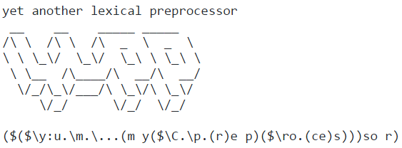

[](doc/README.md)

# yupp

`yupp` 2.0rc1 is a lexical macro preprocessor for C, C++, Python, and
other text-based languages. It embeds a small, fully parenthesized macro
language into ordinary source files and emits readable generated text.

This branch is Python 3-only. CPython 3.11, 3.12, 3.13, and 3.14 are the
supported runtimes. CI also exercises the CPython 3.15 prerelease as an
advisory, non-blocking compatibility signal.

## Install

Install the wheel into the same Python environment that will run `yupp` or a
Python file using the `yupp` source cookie:

```console
python -m pip install yupp
```

For a local checkout:

```console
python -m pip install .
```

`pipx` is useful for isolated command-line applications, but a pipx-only
installation is not suitable for direct `# coding: yupp` scripts: the codec
must be installed in the environment of the Python interpreter that opens the
script.

## Command-line use

Preprocess a source file with either equivalent entry point:

```console
yupp -q eg/hello.yu-c
python -m yupp -q eg/hello.yu-c
```

The suffix determines the output name: for example, `hello.yu-c` produces
`hello.c`, while an ordinary `source.c` produces `source.yugen.c`. Run
`yupp --help` for all configuration and diagnostic options.

```c
($set greeting "Hello ($0)!\n")

#include <stdio.h>

int main(void)
{
    printf(($greeting (`world)));
    return 0;
}
```

See the [language guide](doc/README.md), [built-in functions](doc/builtin.md),
[language evolution note](doc/language-evolution.md),
[evaluator migration guide](doc/yueval-migration.md), and
[tracked examples](eg/README.md).

## Direct Python scripts

An installed, site-enabled Python can preprocess a filesystem-backed main
script before Python parses it:

```python
# coding: yupp

($set greeting '!dlrow olleH')
print(($reversed greeting))
```

Run it normally:

```console
python script.py
```

Use `# coding: yupp.cp1252` (or another registered base codec) when the source
bytes are not UTF-8. Unchanged subsequent runs may use the generated output
cache.

The codec contract is deliberately narrow: it supports the direct main file
given to a site-enabled interpreter. Importing a module whose own source uses a
`yupp` cookie is unsupported. So are `python -S`, stdin, `python -c`, zipapps,
and a script run by a different interpreter environment from the one where
`yupp` is installed. In particular, `-S` disables `site` and the `.pth` hook
that registers the codec.

More detail is in [Macros in Python](doc/python.md).

## Security and migration notes

Process only trusted input. Macro expressions and infix `{ Python }`
expressions can execute Python, `($import ...)` can execute imported Python
files, and `.yuconfig` files are Python scripts. `yupp` is not a sandbox.

When upgrading from the Python 2-compatible release:

- remove dependencies on `future`, `past`, and the backport `builtins` package
  from templates and imported helper files;
- update `.yuconfig` files and Python files loaded through `($import ...)` to
  valid Python 3, because both now execute only on Python 3;
- regenerate cached outputs after changing runtimes. Set `force = True` in a
  trusted `.yuconfig` for one run, or update/remove the generated output, then
  restore normal cache behavior;
- keep legacy macro-language integer suffixes such as `10L` if needed: they
  remain part of the yupp language even though Python source no longer accepts
  them.

The evaluator now gives lambdas lexical scope and evaluates only the selected
conditional branch. Macros, `EVAL` (`$$`), and `&name` remain explicit
caller-context features. Projects that may rely on accidental caller lookup
can run `yupp -Wdynamic-scope ...`; the warning checks executed paths without
substituting caller values. See [Evaluator semantics and
migration](doc/yueval-migration.md) for the full contract, examples, and
compatibility table. There is no legacy dynamic-scope mode.

## Development

Run the local suite and build both distribution formats with:

```console
python -m pip install pytest build twine
python -m pytest -q
python -m build
python -m twine check --strict dist/*
```

The wheel is the installation artifact used by clean-environment tests. The
repository keeps generated examples next to their source templates; update a
template first, regenerate with the current engine, and review both diffs.

The bundled [Sublime Text files](sublime_text/README.md) remain a manually
installed editor integration.

## License

See [LICENSE](LICENSE).
