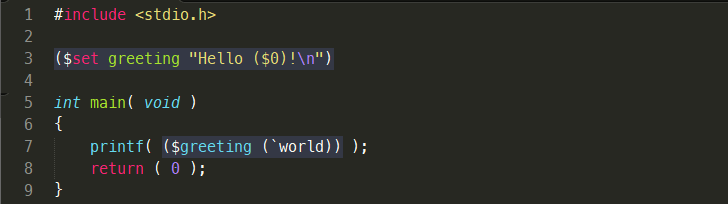
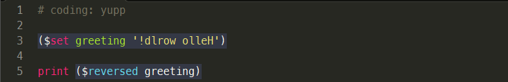

### VERSION

    yupp        1.0c3
                2017-09-09
    python      2.7

### WHAT IS IT?

**yupp** is a lexical preprocessor for C/C++, Python and
`<you name it>` languages.

[READ MORE...](doc/README.md)

### HELLO WORLD

### HELLO IN PYTHON

### LICENSE

Please see the file called [_"LICENSE"_](LICENSE).
