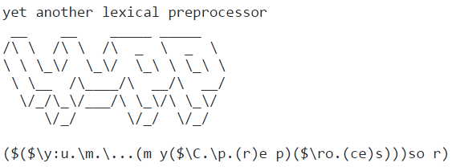

[](README.md)

### WHAT IS IT?

**yupp** is a lexical preprocessor which implements the macro language
with Lisp-like Polish notation syntax in fully parenthesized form.
**yupp** is intended to transform C programs before they are compiled.
It can also be useful for more general purposes. For example, it would
be possible to use macros in Python code if [yupp package](#macros-in-python)
was installed.

**yupp** allows to generate a well-formatted readable text. Special
attention is paid to providing complete diagnostic information and
navigational capabilities.

Embedding of preprocessor expressions into source code occurs by using
**an application form**, e.g. `($e)`.

Please find a commented example of **yupp** using –
["A glance at the preprocessing"](glance.md).

### SYNTAX

The main syntactic categories of the macro language are **a list**,
**an application** and **a lambda expression**.

- **A list** is a sequence of expressions separated by blanks and enclosed
in parentheses, for example:

    `(0.5 "string" atom)`

- **An application** is an applying a function to arguments, it syntactically
differs from a list in presence of the dollar sign after the open
parenthesis:

    `($add 2 3)`

- **A lambda expression** is an anonymous function consisting of a sequence
of parameters and a function body:

    `\param1.\param2.($sub param1 param2)`

Syntactic forms can be nested within each other but, as mentioned above,
only **an application** can be embedded into source code directly.

The following examples show various syntactic constructs of the macro
language. You can try them using [yupp Web Console][console].

    ($! this is a comment, won't be saved in the generated text )

Binding of an atom (identifier) with a value – `($set <atom> <expr>)`:

    ($set a 'A')

An atom binding with a list:

    ($set abc (a 'B' 'C' 'D' 'E'))

Binding of an atom with a lambda is a function definition
 – `($set <atom> <lambda>)`:

    ($set inc \val.($add val 1))

Application of a number is subscripting:

    ($2 miss miss HIT miss)

    HIT

Getting the specific element of a list – `($<number> <list>)`:

    ($0 abc)

    'A'

Application of a list is a _for each_ loop – `($<list> <functions>)`:

    ($(0 1 2) \i.($inc i))

    123

Embedding of one list into another – `*<list>`:

    ($set mark (5 4 *(3 2) 1))

An infix expression in Python – `{<python>}`:

    ($set four { 2 + 2 })

An infix expression straight into source code – `(${} <python>)`:

    foo = (${} sqrt(four) * 5.0);

    foo = 10.0;

A conditional expression – `<consequent> ? <condition> | <alternative>`:

    ($set fact \n.($ 1 ? { n == 0 } | { ($fact { n - 1 }) * n }))
    ($fact 10)

    3628800

Enclosing of source code into an application – `($code <text>)`:

    ($abc \ch.($code putchar(($ch));))

    putchar('A'); putchar('B'); putchar('C'); putchar('D'); putchar('E');

Source code enclosing with the square brackets – `[<text>]`:

    ($mark \i.[($i), ])

    5, 4, 3, 2, 1,

A function (lambda) parameter with a default value
– `\<atom>:<default>.<expr>`:

    ($set if \cond.\then:[].\else:[].($then ? cond | else))

A named argument – `($<function> \<atom> <argument>)`:

    ($if { four != 4 } \else OK)

    OK

A macro definition – `($macro <atom> (<params>) <text>)`:

    ($macro GRADE ( PAIRS )
        ($set GRADE-name  ($(($PAIRS)) \list.($0 list)))
        ($set GRADE-value ($(($PAIRS)) \list.($1 list)))
        ($set each-GRADE  ($range ($len (($PAIRS)) )))
    )

A quote – ``(`<quote>)``:

    ($GRADE
        (`
            ( A 5 )
            ( B 4 )
            ( C 3 )
            ( D 2 )
            ( E 1 )
        )
    )

Enclosing of source code into a loop with the reverse square brackets
– `]<EOL> <text> <EOL>[`:

    ($each-GRADE \i.]
        int ($i GRADE-name) = ($i GRADE-value);

    [ )

    int A = 5;
    int B = 4;
    int C = 3;
    int D = 2;
    int E = 1;

Source code enclosing with the double comma
– `($<function>,,<text>,,<text>)`:

    ($import stdlib)
    ($hex ($BB,,11000000,,11111111,,11101110))

    0xc0ffee

A string substitution – `($<string> <arguments>)`:

    ($ "($0) = ($val)" \val ($round ($pi) 2) (`Pi))

    "Pi = 3.14"

A string evaluation – `($$<string> <arguments>)`:

    ($ ($$'($($func) ($0) ($1))' \func (`mul) 5 5))

    25

An iterator (modifier) – `($emit <atom> <function>)` – NOT applicable
into a loop or a conditional expression – **experimental**:

    ($set i 0)
    ($emit i inc) ($emit i inc) ($emit i dec) ($emit i)

    0 1 2 1

An iterator (modifier) of a list – `($emit <list>)`:

    ($set list ($range 5 25 5))
    ($emit list) ($emit list) ($emit list) ($emit list)

    5 10 15 20

A late bound parameter – `\<late>..\<param>.<expr> <argument &<late>>`:

    ($         \func.\val.($func val) \param.($upper  param) "regular param")
    ($ \param..\func.\val.($func val)        ($upper &param) "late bound param")

    "REGULAR PARAM"
    "LATE BOUND PARAM"

A variable argument list – `\...<expr __va_args__>` – **experimental**:

    ($ \param1.\param2.\...($__va_args__) 1 2 3 4 5)

    345

    ($ \val.\...($ ($lazy __va_args__) \func.[($func val) ])
        9.0
        \n.($sqrt n)
        \n.{ 2 * n }
        \n.($pow n 2)
    )

    3.0 18.0 81.0

Getting names of parameters from a list – `\(<list>).<expr>`:

    ($set params (x y))
    ($ \(params).{ x - y } 100 500)
    ($set params (y x))
    ($ \(params).{ x - y } 100 500)

    -400
    400

Binding of a few atoms at once – `($set (<atoms>) <expr>)`:

    ($set (b c d) ('B' 'C' 'D'))

An atom binding in an expression – `($let <atom> <expr>)`
or `($let (<atoms>) <expr>)`:

    ($let (pow2 pow4) (\x.($mul x x) \x.($pow2 ($pow2 x))) ($pow2 ($pow4 2)))

    256

Creating multiple files from the single source – `($__PASSAGE__ <list>)`:

    ($set __OUTPUT_FILE__ ($__PASSAGE__ ("a.txt" "b.txt" "c.txt")))
    File: ($__OUTPUT_FILE__)

Any functions from _"string"_, _"operator"_ and _"math"_ modules of Python
Standard Library can be used in preprocessor expressions –
[Built-in Functions](builtin.md).

The special `($import <expr>)` form is provided to include macros and
functions from [yupp Standard Library](../lib/README.md)
or other libraries.

### USAGE

**yupp** is written in Python, the main file is _"yup.py"_. Source files
for preprocessing are passed to **yupp** as command-line arguments, for
example:

    python yup.py "./eg/hello.yu-c"

In case [yupp package][package] is installed, you can simply write:

    yupp "./eg/hello.yu-c"

To learn more about the preprocessor parameters, please get help on
the command-line interface:

    python yup.py -h | more

The files generated by the preprocessor are getting other extensions
that could come from the original, for example _".c"_ for _".yu-c"_.
In failing to translate the preprocessor expressions into a plain text
the evaluation result will be saved as _".ast"_ file.

### EXAMPLE

First, we'll output the original source code of our example to the terminal:

    cd yupp
    more "./eg/hello.yu-c"

```cpp
($set greeting "Hello world!\n")

($set name   (  Co       F              Zu           ))
($set type   (  float    double         float        ))
($set val    (  { pi }   (`acos( -1 ))  { 355/113 }  ))
($set format (  "%.2f"   "%.10f"        "%.6f"       ))

($set each-Pi ($range ($len name)))

#include <math.h>
#include <stdio.h>

int main( void )
{
    ($each-Pi \i.]
        ($i type) ($i name) = ($i val);

    [ )
    printf( ($greeting) );

    ($each-Pi \i.]
        ($set n ($i name))
        printf( ($"($0) = ($1)\n" ($n) ($unq ($i format))), ($n) );

    [ )
    return 0;
}
```

Then, we run the preprocessor with the name of this file as a parameter
and the `-q` option to suppress the greeting:

    python yup.py -q "./eg/hello.yu-c"

Finally, we want to see the generated source code:

    more "./eg/hello.c"

```cpp
#include <math.h>
#include <stdio.h>

int main( void )
{
    float Co = 3.14159265359;
    double F = acos( -1 );
    float Zu = 3.14159292035;

    printf( "Hello world!\n" );

    printf( "Co = %.2f\n", Co );
    printf( "F = %.10f\n", F );
    printf( "Zu = %.6f\n", Zu );

    return 0;
}
```

[Further examples...](../eg/)

### MACROS IN PYTHON

You need to install [yupp package][package] in order to use the macro
processor with Python 2:

    pip install yupp

You may need to specify `--pre` key if you want to install a beta version.

After that, you can use macro expressions in source code in Python,
starting your script with:

    # coding: yupp

In addition, this package allows us to call **yupp** preprocessor from
the command-line just by its name:

    yupp "file.yu-c"

[Read more...](python.md)

### SUBLIME TEXT

The folder [_"sublime_text"_](../sublime_text/) contains
configuration files for comfortable
usage of the preprocessor in Sublime Text 2 editor. In addition there is
a plugin for quick navigation between the generated text and its origin.

### VIM

Switching between the generated text and its origin in VIM editor is
[under development][vim].

### TESTKIT

**yupp** is currently in beta stage. The file called
[_"test_yup.py"_](../test_yup.py) contains
a number of _smoke_ tests.

The preprocessor still needs testing and optimization. Also you may run
into problems with completing of the eval-apply cycle when used recursion
or experimental features.

### WEB

- [yupp Wiki][wiki]
- [yupp Blog][blog]
- [yupp Web Console][console]

### PROJECTS

- [LEGO MINDSTORMS EV3 Debian C library][ev3dev-c]
- [predict – an embedded application framework][predict]

### GIT

Enter in the following on your command-line to clone **yupp** repository:

    git clone https://github.com/in4lio/yupp.git

### CONTACT

Please feel free to contact me at in4lio+yupp@gmail.com if you have
any questions about the preprocessor.

[console]:  http://yup-py.appspot.com/
[blog]:     http://yup-py.blogspot.com/
[package]:  https://pypi.python.org/pypi/yupp/
[wiki]:     https://github.com/in4lio/yupp/wiki/
[vim]:      https://github.com/in4lio/vim-yupp/
[ev3dev-c]: https://github.com/in4lio/ev3dev-c/
[predict]:  https://github.com/in4lio/predict/
