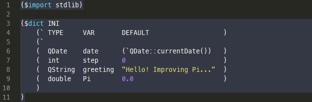
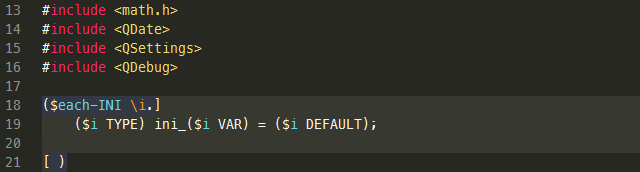
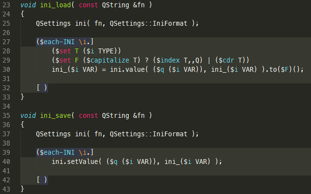
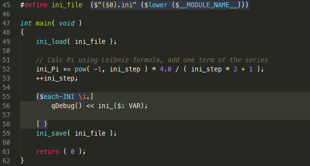

A glance at the yupp
--------------------

The source file of this example is [glance.yu-cpp](../eg/glance/glance.yu-cpp),
the result file - [glance.cpp](../eg/glance/glance.cpp).

Embedding of the preprocessor expressions into the source code (text) occurs
using an __application form__ `($ ... )`.<br>
The first element of an application is a function, that can be called with
arguments, e.g. `($add 40 2)`.<br>
The application `($! ... )` is used for __comments__.

Looking at the preprocessor expressions of this example, you will also meet
the following syntactic forms:
* __simple lists__, e.g. `(0 1 2 3)`;
* __quotes__ - irreducible expressions or strings without quotation marks -
```(` ... )```;
* __source code insertions__ using square brackets `[ ... ]` or reverse square
brackets `]<EOL> ... <EOL>[`<br>
(the insertions also can contain the preprocessor expressions);
* __lambda expressions__ - expressions with parameters - `\a.\b.\c.( ... )`.

__Set form__ `($set ... )` allows to bound an atom with a value, for example
the decrement function definition is<br>
`($set dec \p.($sub p 1))`.

The following code snippet begins with `($import ... )` of the standard library.
The [stdlib.yu](../lib/stdlib.yu) in particular contains<br>
__dict__ macro intended to define a series of lists that make it easy to generate
repeating code structures by a dictionary.



The foregoing application of __dict__ macro corresponds to:

```cpp
($set each-INI (  0                        1     2                         3       ))
($set TYPE     (  QDate                    int   QString                   double  ))
($set VAR      (  date                     step  greeting                  Pi      ))
($set DEFAULT  (  (`QDate::currentDate())  0     "Hello! Improving Pi..."  0.0     ))
```

The application of a list spawns a __cycle__, lambda expressions (or functions)
passed as arguments will be applied<br>
to each element of the list, e.g. `($(2 1 0) \i.($pow 10 i))`.

The application of a number retrieves an argument by index, or if the only
argument is a list, retrieves an element<br>
from this list, e.g. `($2 (miss miss HIT miss))`.



The above snippet generates the following code:

```cpp
#include <math.h>
#include <QDate>
#include <QSettings>
#include <QDebug>

QDate ini_date = QDate::currentDate();
int ini_step = 0;
QString ini_greeting = "Hello! Improving Pi...";
double ini_Pi = 0.0;
```

You probably noticed a few weird using of square brackets. The construction
`]<EOL> ... <EOL>[`<br>
equals to ordinary `[ ... ]` but makes expressions, I dare say, more readable.

Another way to insert a short text into the preprocessor expressions is
the double comma, e.g.<br>
`($count,,Wild Wild World,,W)`.

__Conditional expression__ contains: condition, alternative - an expression
to be evaluated if the condition evaluates to zero (empty list `()`, empty code `[]`
or empty quote ```(`)```) and consequent - an expression to be evaluated for
other values of the condition - ```consequent ? condition | alternative```.



The above functions in unfolded form:

```cpp
void ini_load( const QString &fn )
{
	QSettings ini( fn, QSettings::IniFormat );

	ini_date = ini.value( "date", ini_date ).toDate();
	ini_step = ini.value( "step", ini_step ).toInt();
	ini_greeting = ini.value( "greeting", ini_greeting ).toString();
	ini_Pi = ini.value( "Pi", ini_Pi ).toDouble();

}

void ini_save( const QString &fn )
{
	QSettings ini( fn, QSettings::IniFormat );

	ini.setValue( "date", ini_date );
	ini.setValue( "step", ini_step );
	ini.setValue( "greeting", ini_greeting );
	ini.setValue( "Pi", ini_Pi );

}
```



The foregoing code results in:

```cpp
#define ini_file  "glance.ini"

int main( void )
{
	ini_load( ini_file );

	// Calc Pi using Leibniz formula, add one term of the series
	ini_Pi += pow( -1, ini_step ) * 4.0 / ( ini_step * 2 + 1 );
	++ini_step;

	qDebug() << ini_date;
	qDebug() << ini_step;
	qDebug() << ini_greeting;
	qDebug() << ini_Pi;

	ini_save( ini_file );

	return ( 0 );
}
```
