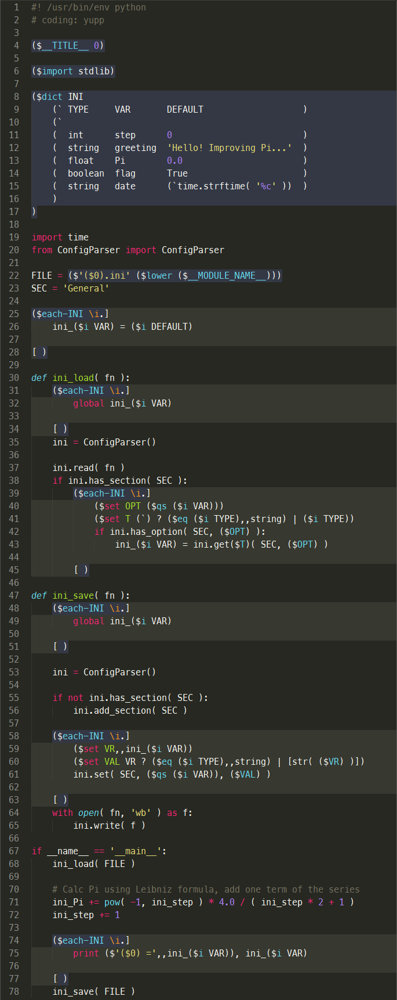

## Macros in Python _(still in the writing process)_

[**yupp**][yupp] is a lexical macro processor designed primarily to make up
for the poor metaprogramming facilities of the C language. The basic idea
behind **yupp** is programming of source code transformation in the functional
style.

If a given task fits in well with the metaprogramming paradigm, **yupp** not
only able to replace the C preprocessor, offering us more options, but also
can serve as a fully viable alternative to the C++ templates. As well,
**yupp** can be used with Python, since [PEP 263][pep-0263] shows us the way
to modify any source file before calling Python’s internal parser.

You have to install [yupp package][package] to use the macro processor with
Python:

    pip install yupp

Then, in order to Python have called **yupp** before running your source code,
you must start your source file with the declaration of `yupp` encoding:

    # coding: yupp

or with the `yupp` encoding followed by a character encoding:

    # coding: yupp.<encoding name>

**yupp** performs a macro-expansion of source code containing macros and
generates source code in pure Python. It happens at the initial stage of
a source file run. Every next run if the original source code does not get
changed, the macro-expansion phase will be skipped and the previously
generated code will be executed directly.

The following example demonstrates how to generate source code in Python using
a dictionary. This script starts with reading data from an ini-file, then
calculates the value of _Pi_ by the Leibniz formula, increasing the value
accuracy at each run, and finally saves the intermediate results back into the
ini-file.



The generated source code in Python:

```py
#! /usr/bin/env python

#  glance.py was generated by yup.py (yupp) 1.0c5
#  out of glance.yu-py

import time
from ConfigParser import ConfigParser

FILE = 'glance.ini'
SEC = 'General'

ini_step = 0
ini_greeting = 'Hello! Improving Pi...'
ini_Pi = 0.0
ini_flag = True
ini_date = time.strftime( '%c' )

def ini_load( fn ):
    global ini_step
    global ini_greeting
    global ini_Pi
    global ini_flag
    global ini_date

    ini = ConfigParser()

    ini.read( fn )
    if ini.has_section( SEC ):
        if ini.has_option( SEC, 'step' ):
            ini_step = ini.getint( SEC, 'step' )
        if ini.has_option( SEC, 'greeting' ):
            ini_greeting = ini.get( SEC, 'greeting' )
        if ini.has_option( SEC, 'Pi' ):
            ini_Pi = ini.getfloat( SEC, 'Pi' )
        if ini.has_option( SEC, 'flag' ):
            ini_flag = ini.getboolean( SEC, 'flag' )
        if ini.has_option( SEC, 'date' ):
            ini_date = ini.get( SEC, 'date' )

def ini_save( fn ):
    global ini_step
    global ini_greeting
    global ini_Pi
    global ini_flag
    global ini_date

    ini = ConfigParser()

    if not ini.has_section( SEC ):
        ini.add_section( SEC )

    ini.set( SEC, 'step', str( ini_step ) )
    ini.set( SEC, 'greeting', ini_greeting )
    ini.set( SEC, 'Pi', str( ini_Pi ) )
    ini.set( SEC, 'flag', str( ini_flag ) )
    ini.set( SEC, 'date', ini_date )

    with open( fn, 'wb' ) as f:
        ini.write( f )

if __name__ == '__main__':
    ini_load( FILE )

    # Calc Pi using Leibniz formula, add one term of the series
    ini_Pi += pow( -1, ini_step ) * 4.0 / ( ini_step * 2 + 1 )
    ini_step += 1

    print 'ini_step =', ini_step
    print 'ini_greeting =', ini_greeting
    print 'ini_Pi =', ini_Pi
    print 'ini_flag =', ini_flag
    print 'ini_date =', ini_date

    ini_save( FILE )
```

Please find the description of the similar example but in C –
["A glance at the preprocessing"](glance.md).

To be continued...

The macro processor gets various options from configuration files.
Options for all files of a directory should be specified in
[_".yuconfig"_](../eg/.yuconfig) file. Whereas individual options
for a particular file in [_"file.yuconfig"_](../eg/dict.yuconfig).

[yupp Wiki][wiki]

[pep-0263]: https://www.python.org/dev/peps/pep-0263/
[package]:  https://pypi.python.org/pypi/yupp/
[yupp]:     https://github.com/in4lio/yupp/
[wiki]:     https://github.com/in4lio/yupp/wiki/
