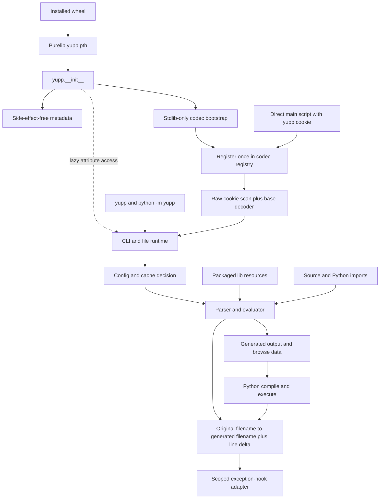
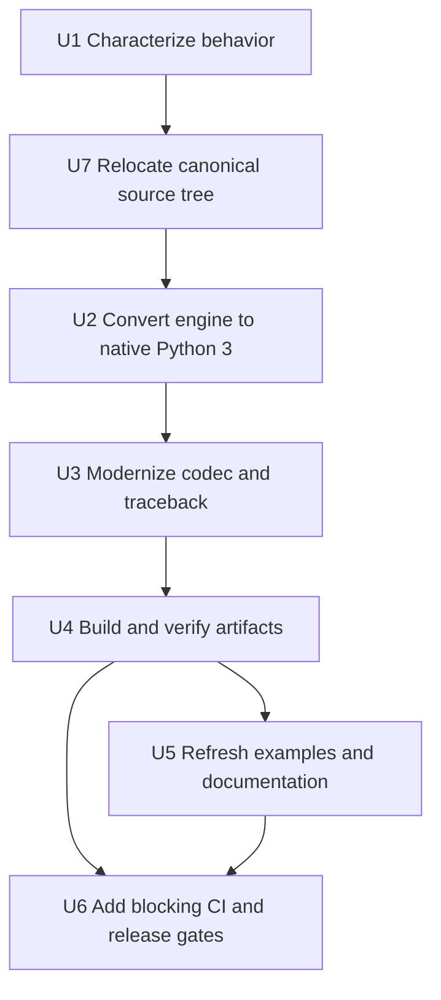

# Python 3 Modernization - Plan

## Goal Capsule

| Field | Contract |
|---|---|
| Objective | Make yupp installable and runnable on maintained CPython 3.11-3.14 without Python 2 compatibility packages while preserving the macro language, generated output, documented entry points, and transparent `# coding: yupp` execution. |
| Authority | The confirmed migration scope overrides incidental legacy behavior; this Product Contract overrides implementation convenience; characterization fixtures and current documentation resolve behavior that the contract does not change explicitly. |
| Execution profile | Characterization-first, sequential implementation in seven units, with clean-wheel subprocess verification as a release blocker. |
| Stop conditions | Stop if exact macro behavior cannot be characterized on Python 3.11, if the wheel cannot install its codec bootstrap into purelib, or if a proposed fix requires a parser/evaluator rewrite or a new import hook for yupp-coded modules. Escalate those as scope changes. |
| Tail ownership | The implementer owns code, tests, generated examples, documentation, packaging artifacts, and CI through a green local and clean-install verification tail. Publishing a release or changing repository hosting is not authorized. |

---

## Product Contract

### Summary

Yupp will become a Python 3-only package with one canonical source tree, modern build metadata, no `future` dependency, and blocking support for CPython 3.11 through 3.14.
The existing lexical macro language and its generated output remain the compatibility boundary.
The documented CLI, programmatic API, bundled macro libraries, cache, multi-passage generation, and direct execution through `# coding: yupp` remain supported.

### Problem Frame

The repository still carries a dual-Python implementation and a copied packaging tree from 2021.
On Python 3.14 the current import fails first on the external `future` package, and the next runtime blocker is `imp`, which Python removed in 3.12.
The problem is deeper than import cleanup: several documented DSL builtins depend on Python 2 string behavior, the traceback adapter is a fork of Python 3.9 internals, and transparent source decoding depends on a root-level `.pth` file being installed before Python parses the main script.
The current custom test harness provides useful parser and evaluator oracles, but it does not prove CLI, codec, traceback, packaging, or fresh-install behavior.

### Actors

- A1. CLI user preprocesses one or more source files and depends on output naming, configuration, imports, caching, browse data, backups, passages, diagnostics, and exit status.
- A2. Python codec user runs an installed yupp-coded script without first importing `yupp`.
- A3. Programmatic API user calls `yupp.translate` or `yupp.cli` and depends on their callable shape and return contract.
- A4. Generated-code consumer depends on exact emitted text, macro errors that point to the macro source, and Python compile/runtime frames that point to the generated artifact and adjusted line.
- A5. Maintainer builds and installs wheel and sdist artifacts, runs the supported-version matrix, and checks the next prerelease without publishing it.

### Requirements

**Runtime and language compatibility**

- R1. The package shall support CPython 3.11, 3.12, 3.13, and 3.14, declare `Requires-Python >=3.11`, and run the same suite against Python 3.15 as a non-blocking prerelease signal until 3.15 is stable.
- R2. Active product code, tests, templates, generated examples, and packaging shall contain no dependency or compatibility imports from `future`, `past`, or the backport `builtins` package, and shall contain no Python 2 runtime branch.
- R3. Parser ASTs, evaluator results, documented syntax, legacy integer suffixes `L/l`, and deterministic generated output shall remain compatible with the characterized baseline.
- R4. Documented DSL builtins and import behavior shall preserve their macro-level contract while using native Python 3 implementations, including `atol`, `maketrans`, `translate`, escaped strings, Python-file imports, once-only source imports, and bundled-library imports.

**Entrypoints and execution behavior**

- R5. CLI behavior shall preserve input/output naming, response files, inline input, configuration loading, import directories, dependency caching, backup/read-only handling, browse JSON, multi-passage output, and continuation after an individual file failure.
- R6. CLI exit status shall follow the existing documented contract: success `0`, internal execution failure `1`, argument failure `2`, and `4 * failed_file_count` for per-file preprocessing failures; `yupp` and `python -m yupp` shall agree.
- R7. The public `yupp.cli`, `yupp.translate`, package metadata attributes, and `python -m yupp` entry point shall remain available after package initialization becomes lazy.
- R8. An ordinary installed Python process shall recognize `yupp` and `yupp.<base-encoding>` source cookies on the first or second line and directly execute the main script without a prior `import yupp`.
- R9. Preprocessing and macro-import failures shall retain their source locations, while generated-syntax and runtime frames shall map the compiled original filename to the generated artifact plus the characterized line delta without replacing `traceback.StackSummary` or other standard traceback objects.

**Packaging and resources**

- R10. The repository shall build from one canonical `src/yupp` tree through a root `pyproject.toml` using current setuptools metadata without importing the runtime during the build.
- R11. Wheel and sdist artifacts shall include all required `lib/*.yu` resources, console metadata, license/readme metadata, and the tracked codec-bootstrap build input; the wheel shall contain exactly one root-purelib `yupp.pth` in `RECORD`, and runtime metadata shall have no third-party dependency.
- R12. The legacy `package/` staging copy, copy/upload scripts, tracked distribution archives, duplicate plain-text documentation, and obsolete Travis workflow shall not remain part of the active build or documentation surface.

**Verification and documentation**

- R13. Pytest characterization, integration, error-path, generated-output, and clean-install tests shall prove the contract without parallel execution assumptions or accidental imports from the checkout.
- R14. GitHub Actions shall block on Python 3.11-3.14 tests and installed-artifact smoke tests across Linux, macOS, and Windows, while exposing Python 3.15 failures without blocking.
- R15. Documentation and Python examples shall describe supported CPython 3.11-3.14, the non-blocking Python 3.15 prerelease signal, current commands, current stdlib imports, direct-script codec support, the `python -S` limitation, and trusted-code behavior for macros, Python imports, infix evaluation, and `.yuconfig`.

### Key Flows

- F1. Build and clean install
  - **Trigger:** A5 builds from a clean checkout.
  - **Actors:** A5
  - **Steps:** Build sdist and wheel; inspect metadata and payload; install the wheel into the same interpreter environment that will execute the yupp-coded source; start a new interpreter outside the checkout; verify CLI, module entry point, public API, codec registration, and bundled-library import.
  - **Outcome:** The artifact works without `future` or repository-path leakage.
  - **Covered by:** R1, R2, R7, R10, R11, R13, R14

- F2. CLI preprocessing
  - **Trigger:** A1 supplies one or more source paths.
  - **Actors:** A1, A4
  - **Steps:** Resolve current configuration precedence; derive each output name; preprocess sequentially; write backup/output/browse files; repeat configured passages; continue after a file error; return the documented aggregate status.
  - **Outcome:** Successful files retain their exact generated output and failed files are visible to shell automation.
  - **Covered by:** R3, R5, R6, R9

- F3. Cache decision
  - **Trigger:** An expected output already exists.
  - **Actors:** A1, A2
  - **Steps:** Compare source, configuration dependencies, and declared dependencies with the output; use the cache only when every dependency is strictly older and force is false; otherwise preprocess.
  - **Outcome:** A cache hit does not rewrite output or create a backup; uncertain state safely regenerates.
  - **Covered by:** R5, R8

- F4. Direct yupp-coded Python execution
  - **Trigger:** A2 runs `python script.py` and the source cookie names `yupp`.
  - **Actors:** A2, A4
  - **Steps:** Site processing executes the root `.pth` hook; `yupp.__init__` imports only stdlib-only bootstrap/metadata code; the codec matches and delegates the base encoding from raw cookie bytes; preprocessing runs lazily for a filesystem-backed main script; generated Python is compiled and executed; relevant runtime frames are remapped.
  - **Outcome:** First and cached runs behave like ordinary Python execution while preserving yupp preprocessing.
  - **Covered by:** R8, R9, R10, R11

- F5. Macro and Python imports
  - **Trigger:** Evaluation encounters a source, bundled-library, computed, or Python-file import.
  - **Actors:** A1, A2, A4
  - **Steps:** Resolve from the input directory, configured directories, then installed bundled resources; suppress repeat imports according to current semantics; execute trusted Python imports with importlib; inject the same symbols into the builtin environment.
  - **Outcome:** The same macros and generated output are available on every supported Python.
  - **Covered by:** R3, R4, R11, R15

- F6. Error and traceback mapping
  - **Trigger:** Parsing, evaluation, import, generated compilation, or generated runtime fails.
  - **Actors:** A1, A2, A3, A4
  - **Steps:** Preserve macro-source locations for parser/evaluator/import failures; map compiled runtime frames from the original script name to the generated output name and line delta through a local adapter built on public traceback APIs; emit a nonzero process status where applicable.
  - **Outcome:** Diagnostics identify the correct macro source or generated artifact for the failure stage, and no partial or empty program is treated as success.
  - **Covered by:** R6, R9

### Acceptance Examples

- AE1. On each CPython 3.11-3.14, the original eight parser cases and thirteen substantive evaluator cases produce the same ASTs, exceptions, and normalized output as the Python 3.11 characterization baseline.
- AE2. `x.yu-c` produces `x.c`, `x.yu-py` produces `x.py`, `x.c` produces `x.yugen.c`, `x.yu` produces `x.yugen`, and `x.c.yu` produces `x.c`.
- AE3. A CLI invocation with one valid and one invalid file processes the valid file and exits `4`; two invalid files exit `8`; `yupp` and `python -m yupp` expose identical status.
- AE4. An unchanged second run uses the cached generated file without changing its mtime or creating a new backup; changing the source, a loaded config, or a declared dependency regenerates it; force always regenerates it.
- AE5. `eg/passage.yu-c` creates exactly `passage-a.c`, `passage-b.c`, and `passage-c.c` with characterized content and terminates the passage loop.
- AE6. In a clean wheel-installed environment outside the checkout, a new process directly runs UTF-8 scripts with the cookie on line one and after a shebang, including CRLF and no-final-newline fixtures, without an explicit `import yupp`.
- AE7. In the same environment, `# coding: yupp.cp1252` preserves the non-UTF-8 fixture, while an unknown base encoding fails visibly and nonzero.
- AE8. Preprocessor/import errors identify their macro source location; invalid generated Python and runtime exceptions fail nonzero and identify the generated artifact plus adjusted line; chained exceptions, notes, columns, and exception groups retain modern Python traceback information.
- AE9. `($import stdlib)`, explicit `.yu` imports, computed imports, and Python-file imports work from the installed wheel; the Python module executes once and exposes the characterized namespace and `sys.modules` behavior.
- AE10. `atol`, `maketrans`, `translate`, escape decoding, and `L/l` integer syntax pass explicit macro-language tests without Python 2 compatibility packages.
- AE11. Importing the lightweight bootstrap does not change the recursion limit or add yupp logging handlers; importing `yupp` repeatedly leaves codec registration behavior idempotent.
- AE12. Wheel inspection finds exactly one `yupp.pth` in purelib root, `yupp/lib` resources in the package, and no `Requires-Dist: future`; install records the hook and uninstall removes it.
- AE13. An imported Python module that itself declares `# coding: yupp` is documented as unsupported and is not made to process `sys.argv[0]` accidentally; direct main-script execution remains the supported codec contract.
- AE14. `python -S script.py` is documented as unsupported because it disables `site` and `.pth` processing.
- AE15. Codec preprocessing is not promised for stdin, `python -c`, zipapps, or a CLI installed only through pipx; unsupported invocations never preprocess an unrelated `sys.argv[0]`.

### Success Criteria

- Every blocking test and artifact gate passes on CPython 3.11-3.14.
- The installed wheel works from a directory outside the checkout on Linux, macOS, and Windows.
- Active code contains no import from `future`, `past`, or the backport `builtins` package and no use of `imp`, stdlib `distutils`, `execfile`, `xrange`, or the Python 2 traceback fork.
- Deterministic parser/evaluator and example fixtures have no unexplained output drift.
- Build metadata has no runtime dependency and the source distribution can reproduce the wheel.
- No strict expected-failure marker introduced for a known Python 3 compatibility defect remains after U2.

### Scope Boundaries

**Included**

- Native-Python-3 runtime conversion, documented compatibility defects exposed by that conversion, packaging, tests, generated examples, documentation, and CI.
- Minimal Python 3 syntax repair in the bundled Sublime Text plugin so the active repository contains no `xrange` or other Python 2-only code.

**Deferred**

- General support for importing Python modules whose own source cookie is `yupp`; this needs a finder/loader design because codec decoders do not receive the imported filename.
- Converting the Python 3.15 job into a blocking requirement after Python 3.15 reaches stable release.
- Isolating or redesigning global evaluator state after its current sequential lifecycle is characterized.

**Outside this migration**

- Rewriting the parser, evaluator, or macro language; changing macro syntax; broad formatting, linting, typing, or performance work.
- Sandboxing macros, infix Python, `.yuconfig`, or imported Python; yupp continues to process trusted input.
- Supporting transparent codec startup under `python -S`.
- Supporting codec preprocessing for stdin, `python -c`, zipapps, or an interpreter environment different from the one where yupp is installed, including pipx-only CLI installations.
- Rebuilding the web console, productizing the Sublime plugin, publishing to PyPI, choosing a new product version, or creating a release.

---

## Planning Contract

### Output Structure

```text
pyproject.toml
setup.py                     # only if the purelib hook needs a backend extension
yupp.pth                    # tracked build input for wheel purelib root
src/
  yupp/
    __init__.py             # lightweight registration and lazy public API
    __main__.py
    _codec.py
    _traceback.py
    pp/
    pylib/
    lib/
tests/
```

The `pp` and `pylib` subpackages remain during this migration to limit semantic churn.
The artifact test, not this source location, is authoritative for where `yupp.pth` installs.

### Key Technical Decisions

- KTD1. Support every maintained CPython line from 3.11 through 3.14. Python 3.11 remains both the last executable legacy oracle and a supported security-maintenance release; 3.10 is omitted because its support ends in October 2026.
- KTD2. Freeze behavior before replacing compatibility code. Existing `test_yup.py` data becomes parametrized pytest input without rewriting expected ASTs or result strings, and each newly discovered legacy semantic gets a focused characterization before its implementation changes.
- KTD3. Separate Python 2 implementation artifacts from DSL compatibility. Python imports and branches are deleted, but language tokens and documented builtins such as `L/l` and `atol` remain and receive native Python 3 implementations.
- KTD4. Replace `imp.load_source` with a transactional importlib lifecycle after Python 3.11 fixes module identity and collision behavior. Resolve the path, create the spec/module, stage the module in `sys.modules` for recursive imports, execute it, and publish builtin names/repeat state only on success; failure restores the prior module entry. `runpy.run_path` and deprecated shortcuts are rejected because they do not preserve the characterized module lifecycle.
- KTD5. Preserve transparent codec startup through a minimal root-purelib `.pth` hook and an explicit import DAG. `yupp.__init__` may import only stdlib-only codec bootstrap and side-effect-free metadata, register once, and expose `cli`/`translate` lazily; it may not import engine/traceback modules, configure logging, or change recursion limits.
- KTD6. Guarantee ordinary site-enabled CPython execution of a filesystem-backed direct main script in the environment where yupp is installed. The bootstrap scans raw first/second-line cookie bytes, matches normalized `yupp` names exactly, and delegates `yupp.<encoding>` through the codec registry; imported yupp-coded modules, `-S`, stdin, `-c`, zipapps, and pipx-isolated interpreters are rejected as unsupported rather than reusing an unrelated `sys.argv[0]`.
- KTD7. Preserve the current mapping model: compiled frames initially carry the original script filename, then map to `generated_output_filename` and `line - header_shrink + 1`. Replace the Python 3.9 fork with a scoped, idempotent `sys.excepthook` installed only after successful direct-main preprocessing; retain/delegate the prior hook, transform only registered frames through public `TracebackException` summaries, recurse through chains/groups, and never replace `traceback.StackSummary`.
- KTD8. Follow documented CLI status rather than the accidental zero exit from current entry points. `main()` returns `cli()` status and module/console launchers propagate it with `SystemExit`.
- KTD9. Use a `src/yupp` layout, static PEP 621 metadata, and setuptools as the build backend. Exactly one `yupp.pth` at wheel purelib root and in `RECORD` is an artifact invariant; package data, generic `data_files`, console entry points, `sitecustomize`, and pipx are not substitutes. A minimal custom build hook is acceptable only to satisfy that invariant.
- KTD10. Keep tests sequential by default. Global `config`, `feedback`, `yushell`, `builtin`, default evaluator environments, and passage state are characterized but not redesigned.
- KTD11. Keep the current trusted-input security boundary and document it. Migration work must not imply that Python imports, config execution, macro evaluation, or infix expressions are safe for untrusted input.

### High-Level Technical Design

The startup path separates registration from processing so installing yupp cannot make every Python process import the parser or mutate global engine state.
The CLI and codec converge on one lazy runtime service, while the traceback adapter transforms only registered runtime frames and retains the previous process exception hook.



The migration order preserves an executable Python 3.11 oracle until the engine no longer imports removed APIs, then proves startup behavior from real artifacts.



### System-Wide Impact

- **Interpreter startup:** `.pth` executes in every ordinary process using the environment, so its import path must be side-effect-light and stdlib-only.
- **State lifecycle:** The evaluator uses module globals and mutable default environments; tests and CLI inputs remain sequential to avoid inventing isolation semantics.
- **Filesystem:** Output backups, read-only flags, cache mtimes, multi-passage files, and generated codec files remain observable behavior and require temporary-directory tests on each operating system.
- **Diagnostics:** Parser/evaluator/import failures use macro-source locations, while generated compile/runtime failures use an original-to-generated filename map plus header line delta; the scoped exception hook must preserve unrelated exceptions and any prior hook.
- **Distribution:** Source layout, bundled libraries, console scripts, the purelib hook, and uninstall recording must agree across wheel and sdist rather than only in editable installs.

### Sequencing Constraints

1. Run U1 on CPython 3.11 with the existing compatibility dependency before deleting the legacy implementation.
2. Move the current tree in U7 without behavior edits so all later code work targets final `src/yupp` paths.
3. Do not enable Python 3.12-3.14 as blocking until U2 replaces `imp` and all imported compatibility packages.
4. Complete local codec/traceback behavior in U3 before claiming transparent installed startup.
5. Do not delete legacy package staging until U4 produces both artifacts and their payload tests pass.
6. Regenerate tracked examples from updated source templates only after the new engine is green; review every golden diff.
7. Enable blocking CI only after source-tree and installed-wheel commands are deterministic locally.

### Risks and Mitigations

| Risk | Impact | Mitigation |
|---|---|---|
| Python 2 string semantics leak through documented DSL builtins | Silent generated-output drift | Characterize every affected builtin, implement explicit Python 3 adapters, and retain exact result fixtures. |
| Root `.pth` is packaged into the wrong wheel scheme | `# coding: yupp` fails before user code | Inspect wheel members and installed purelib, then launch a fresh subprocess outside the checkout on every blocking platform/version. |
| Eager bootstrap imports the engine | Every interpreter startup changes recursion/logging state or fails | Split codec registration into a stdlib-only module and assert startup side effects are absent. |
| Traceback internals differ across 3.11-3.14 | Lost notes/groups/columns or crashes on errors | Keep an explicit original-to-generated mapping record, transform public summaries through a scoped hook, preserve the previous hook, disable color for goldens, and test chains, groups, syntax, and runtime paths. |
| Importlib differs from `imp.load_source` | Repeat imports or module identity change | Characterize `sys.modules` and failure cleanup on 3.11 before replacement. |
| Global evaluator state makes isolated tests misleading | Order-dependent regressions | Preserve a sequential suite, add explicit multi-file state scenarios, and do not enable xdist. |
| Cache timestamps and read-only flags vary by filesystem | Flaky cross-platform tests | Use controlled temp files, advance mtimes explicitly, test semantic state rather than wall-clock sleeps, and isolate Windows permission assertions. |
| Cleanup deletes historical evidence needed by users | Lost context | Keep history in git, merge still-useful package instructions into canonical Markdown, and remove only active duplicates/artifacts. |

### Research Anchors

- Existing parser/evaluator oracle: `test_yup.py:31`, `test_yup.py:171`, and `test_yup.py:740`.
- Removed and compatibility APIs: `pp/yugen.py:18`, `pp/yugen.py:35`, `pp/yugen.py:890`, `pp/yup.py:18`, and `__init__.py:20`.
- Macro-level compatibility surfaces: `pp/yugen.py:811`, `pp/yugen.py:2701`, `pp/yugen.py:2723`, `pp/yugen.py:2729`, and `doc/builtin.md:129`.
- Codec and bootstrap: `__init__.py:40`, `__init__.py:82`, `__init__.py:125`, `package/yupp.pth:1`, and `package/setup.py:122`.
- CLI state and documented status: `pp/yup.py:100`, `pp/yup.py:371`, `pp/yup.py:512`, `pp/yup.py:562`, and `__main__.py:22`.
- Global engine state: `pp/yugen.py:51`, `pp/yugen.py:2701`, `pp/yugen.py:3057`, and `pp/yugen.py:3069`.
- [Supported Python versions](https://devguide.python.org/versions/) establishes the 3.11-3.14 blocking matrix on 2026-07-14.
- [Python 3.12 porting guide](https://docs.python.org/3.12/whatsnew/3.12.html#imp) supplies the official `imp.load_source` replacement and records removal of `imp`.
- [Codec registry documentation](https://docs.python.org/3.14/library/codecs.html) defines search-function, stateless, incremental, and stream codec contracts.
- [PEP 263](https://peps.python.org/pep-0263/) defines the first/second-line source-cookie behavior.
- [Python site documentation](https://docs.python.org/3.14/library/site.html) defines executable `.pth` startup behavior and the `-S` limitation.
- [Traceback documentation](https://docs.python.org/3.14/library/traceback.html) defines the public formatting APIs and version-specific changes.
- [PyPA pyproject guide](https://packaging.python.org/en/latest/guides/writing-pyproject-toml/) and [src layout guidance](https://packaging.python.org/en/latest/discussions/src-layout-vs-flat-layout/) shape the canonical build.
- [Setuptools data-file guidance](https://setuptools.pypa.io/en/latest/userguide/datafiles.html) shapes bundled resources; the purelib `.pth` remains a separately verified exception.
- [GitHub Actions Python guide](https://docs.github.com/en/actions/tutorials/build-and-test-code/python) shapes the version matrix.

---

## Implementation Units

### U1. Freeze the Python 3.11 behavioral baseline

- **Goal:** Turn the current ad hoc oracle and representative examples into a deterministic pytest characterization suite before runtime changes.
- **Requirements:** R3, R4, R5, R6, R7, R9, R13
- **Files:** `test_yup.py`, `tests/fixtures/legacy_cases.py`, `tests/test_parser.py`, `tests/test_evaluator.py`, `tests/test_cli.py`, `tests/test_imports.py`, `tests/test_examples.py`, `pytest.ini`
- **Approach:** First prove the original harness and extracted parametrized cases agree under Python 3.11; reuse the eight parse records and thirteen substantive evaluation records verbatim; preserve exact AST equality and normalized strings; encode currently broken documented Python 3 contracts such as `atol`, `maketrans`/`translate`, and escape decoding as named strict expected failures; run file/config/cache/passage tests in temporary directories; record current import-module identity and sequential state; compare generated examples without auto-updating goldens.
- **Test Scenarios:** Original-harness/pytest parity; parser success/error cases; evaluator output/error cases; `L/l`; known-defect contracts for `atol`, `maketrans`/`translate`, and escape decoding; `.yu`/`.py`/computed imports; repeated imports and name collisions; output-name table; config precedence; cache hit/miss/force; browse JSON; backup/read-only; response file; inline input; multi-file failure count; passage outputs; public return shapes; sequential multi-file state.
- **Verification:** In a disposable Python 3.11 environment containing only the current required `future` compatibility dependency and pytest, run the original harness and `python -m pytest -q -m "not packaging"`; their overlapping cases agree, only the named known-defect contracts xfail, and no environment or generated output is saved into the repository.
- **Dependencies:** None.

### U7. Relocate one canonical source tree without changing behavior

- **Goal:** Move the executable package and bundled libraries to their final `src/yupp` paths before native-Python and codec edits, while retaining the Python 3.11 oracle.
- **Requirements:** R3, R7, R10, R13
- **Files:** `__init__.py`, `__main__.py`, `pp/**`, `pylib/**`, `lib/**`, `src/yupp/**`, `pytest.ini`, `test_yup.py`, `tests/**`
- **Approach:** Relocate files mechanically, preserve internal `pp` and `pylib` package names, update only import/resource/test paths, configure source tests to import from `src`, and remove the superseded root harness after its fixtures are proven equivalent. Do not alter engine, codec, traceback, metadata, or generated behavior in this unit.
- **Test Scenarios:** Original fixture parity from new import paths; bundled-library lookup from `src/yupp/lib`; `yupp.cli`/`yupp.translate` availability with the temporary legacy dependency; no import from the old root module paths; no deterministic example diff.
- **Verification:** Run `python -m pytest -q -m "not packaging"` in the same disposable Python 3.11 baseline and compare its collected cases/results with U1.
- **Dependencies:** U1.

### U2. Convert the runtime engine to native Python 3

- **Goal:** Make parser, evaluator, configuration, and import execution work on Python 3.11-3.14 without compatibility packages or removed APIs.
- **Requirements:** R1, R2, R3, R4, R5, R13
- **Files:** `src/yupp/__init__.py`, `src/yupp/__main__.py`, `src/yupp/_codec.py`, `src/yupp/pp/yugen.py`, `src/yupp/pp/yup.py`, `src/yupp/pp/yulic.py`, `src/yupp/pp/yuconfig.py`, `src/yupp/lib/coroutine-py.yu`, `requirements.txt`, `tests/test_parser.py`, `tests/test_evaluator.py`, `tests/test_imports.py`, `tests/test_cli.py`, `tests/test_entrypoints.py`
- **Approach:** Remove redundant `__future__` and backport imports; split current codec registration mechanically into a stdlib-only module so `yupp.__init__` can expose public API lazily without `future`; replace `raise_` with native exception propagation; replace `native_str` with `str`; execute config through `compile` plus `exec` using the real filename and existing shared context; implement the transactional importlib lifecycle from KTD4; remove `SOURCE.__getslice__`; use `logging.warning`; implement explicit Python 3 forms of legacy DSL builtins; delete the now-empty legacy requirements file.
- **Test Scenarios:** All U1 core cases on 3.11-3.14; every strict known-defect contract turns green; Python import identity, collision, recursive import, repeat suppression, and failure rollback; config script filename/context; string translation/deletion mapping; long integer macro syntax; unknown imports; logger warning paths; `import yupp` plus lazy `cli`/`translate` without `future`.
- **Verification:** Run `python -m pytest -q -m "not packaging" tests/test_parser.py tests/test_evaluator.py tests/test_imports.py tests/test_cli.py tests/test_entrypoints.py` under each supported interpreter; no compatibility xfail remains and importing yupp requires no third-party package.
- **Dependencies:** U7.

### U3. Modernize codec startup and traceback mapping

- **Goal:** Preserve transparent direct-script execution and source-mapped diagnostics using supported Python 3 APIs and a lightweight registrar.
- **Requirements:** R6, R7, R8, R9, R13
- **Files:** `src/yupp/__init__.py`, `src/yupp/__main__.py`, `src/yupp/_codec.py`, `src/yupp/_traceback.py`, `src/yupp/pp/__main__.py`, `src/yupp/pylib/yutraceback.py`, `src/yupp/pylib/yutraceback2.py`, `src/yupp/pylib/yutraceback3.py`, `tests/test_codec.py`, `tests/test_traceback.py`, `tests/test_entrypoints.py`
- **Approach:** Resolve base encodings through `codecs.lookup` and scan cookie bytes without reopening through the locale; preserve first/second-line cookies and the characterized shebang delta; keep decoder contracts for empty/stateless/incremental/stream inputs; reject filename-less/unsupported contexts before touching `sys.argv[0]`; raise instead of converting preprocessing failure to empty success; replace copied traceback modules with the scoped KTD7 hook and mapping record; propagate `cli()` status through both launchers.
- **Test Scenarios:** UTF-8 and cp1252; normalized exact codec names; cookie line one/two; shebang; CRLF; no final newline; empty and chunked decoder input; BOM conflict; unknown encoding; preprocessing failure; generated `SyntaxError`; runtime exception mapped to generated filename/delta; chains, notes, columns, nested `ExceptionGroup`, recursion; prior-hook delegation; idempotent registration; no recursion/logging mutation; imported module/stdin/`-c`/zipapp contexts fail clearly without preprocessing unrelated input.
- **Verification:** Run `PYTHON_COLORS=0 python -m pytest -q tests/test_codec.py tests/test_traceback.py tests/test_entrypoints.py` on 3.11-3.14 in isolated subprocesses with explicit bootstrap registration. This unit proves codec semantics, not first-process wheel startup; U4 alone proves site-installed `.pth` behavior.
- **Dependencies:** U2.

### U4. Establish the canonical package and reproducible artifacts

- **Goal:** Replace copied package staging with reproducible artifacts from the canonical `src/yupp` tree and prove wheel/sdist installation, resources, codec bootstrap, and uninstall behavior.
- **Requirements:** R1, R2, R7, R8, R10, R11, R12, R13
- **Files:** `pyproject.toml`, optional minimal `setup.py` custom build hook, `yupp.pth`, `src/yupp/**`, `tests/test_packaging.py`, `LICENSE`, `README.md`, `package/**`, `script/pkg-*`, `.gitignore`
- **Approach:** Declare static PEP 621 metadata and `yupp = yupp.__main__:main` without importing runtime metadata; retain the current prerelease identity without publishing a release; include all macro/header resources; add only the smallest backend extension needed to place exactly one `yupp.pth` at wheel purelib root and in `RECORD`; reject generic data-file locations that install outside purelib; remove staging setup, copy/upload scripts, and tracked tarballs only after replacement artifacts pass.
- **Test Scenarios:** Build without importing yupp; inspect wheel/sdist member lists; metadata and classifier checks; install the exact wheel into isolated environments outside checkout; assert `yupp.__file__` belongs to that environment; direct codec startup without prior import in the same interpreter environment; console/module/public API parity; packaged `stdlib` and coroutine import; build a second wheel from an extracted sdist outside checkout and compare normalized payload/metadata; editable install as informational; uninstall in a new process removes `.pth` and leaves the codec unavailable to subsequent processes.
- **Verification:** Run `python -m build`, `python -m twine check --strict dist/*`, and the packaging-marked test suite separately; it must scrub `PYTHONPATH`, change outside the checkout, inspect exact artifact payloads, install the exact wheel, and build/install again from the extracted sdist.
- **Dependencies:** U3.

### U5. Refresh examples, editor code, and canonical documentation

- **Goal:** Remove active Python 2 guidance and compatibility imports, regenerate examples from their source templates, and document the supported installation/execution contract.
- **Requirements:** R2, R3, R12, R15
- **Files:** `README.md`, `README`, `doc/README.md`, `doc/README`, `doc/python.md`, `doc/builtin.md`, `eg/**`, `src/yupp/lib/**`, `sublime_text/Data/Packages/yupp/yupp.py`, `sublime_text/README.md`, `tests/test_examples.py`, `tests/test_no_legacy.py`
- **Approach:** Make Markdown canonical and delete duplicate plain versions after merging unique content; replace Python 2 imports/print/config examples in source templates first; regenerate tracked outputs with the migrated engine; accept only explained compatibility-neutral diffs; replace `xrange` in the bundled plugin without otherwise productizing it; document Python 3.11-3.14, wheel install, trusted input, direct-script-only codec, `-S` limitation, cache, test, and build commands.
- **Test Scenarios:** Regenerate each tracked example in an isolated copy; compare deterministic files byte-for-byte and normalize only declared timestamp fragments; scan active code/templates/docs for forbidden compatibility APIs; run documentation command snippets that are practical to automate.
- **Verification:** Run `python -m pytest -q tests/test_examples.py tests/test_no_legacy.py` and review every committed generated-file diff alongside its source template.
- **Dependencies:** U4.

### U6. Replace legacy CI with supported-version and artifact gates

- **Goal:** Make all supported interpreters and installed-artifact behavior blocking, with early non-blocking visibility into Python 3.15.
- **Requirements:** R1, R11, R13, R14
- **Files:** `.github/workflows/ci.yml`, `.travis.yml`, `pyproject.toml`, packaging/integration test helpers under `tests/`
- **Approach:** Build artifacts once with current `actions/setup-python`; run the non-packaging source suite on Ubuntu 3.11-3.14; install and smoke the exact same wheel across Linux, macOS, and Windows for every supported version; run the sdist-rebuild gate once in a clean job; use fresh subprocesses for codec cases; treat warnings from yupp as errors with narrow documented exceptions; run Python 3.15 prerelease with `continue-on-error` and full visible logs.
- **Test Scenarios:** Source checkout tests; artifact download/install; console and module status parity; direct UTF-8/cp1252 codec execution; bundled resources; no checkout import; Windows paths/backup/read-only behavior; macOS/Linux permissions; 3.15 full-suite report.
- **Verification:** Re-run every workflow command locally where the platform is available, then require green build, 3.11-3.14 test, metadata, and installed-wheel jobs. Confirm a deliberately failing 3.15 probe would not block required checks.
- **Dependencies:** U4, U5.

---

## Verification Contract

| Gate | Command or mechanism | Applies to | Pass signal |
|---|---|---|---|
| Characterization baseline | Original `test_yup.py` plus `python -m pytest -q -m "not packaging"` | U1, U7 | Overlapping legacy/pytest cases agree sequentially on Python 3.11 and only named known-defect contracts xfail. |
| Full source suite | `python -m pytest -q -m "not packaging"` | U2-U6 | All source tests pass with no compatibility xfail, project warnings treated as errors, and no xdist. |
| Codec and traceback | `PYTHON_COLORS=0 python -m pytest -q tests/test_codec.py tests/test_traceback.py tests/test_entrypoints.py` | U3-U6 | Fresh subprocesses preserve direct execution, nonzero failures, and source mappings on 3.11-3.14. |
| Build artifacts | `python -m build` | U4-U6 | Both sdist and wheel build in isolation without importing the runtime. |
| Metadata | `python -m twine check --strict dist/*` | U4-U6 | Both artifacts pass strict checks and declare Python 3.11+ with no runtime dependency. |
| Installed wheel | Packaging-marked pytest gate against the exact built wheel | U4-U6 | An isolated environment outside checkout imports from its own site-packages and passes CLI, API, resource, codec, payload, and new-process uninstall checks. |
| Sdist reproducibility | Packaging-marked pytest gate that extracts the sdist and builds outside checkout | U4-U6 | The sdist-derived wheel has equivalent normalized metadata/payload and passes the same installation smoke. |
| Legacy removal | `python -m pytest -q tests/test_no_legacy.py` | U5-U6 | No forbidden compatibility imports/APIs or duplicate active packaging/docs remain. |
| CI matrix | GitHub Actions blocking jobs | U6 | Ubuntu full suite and Linux/macOS/Windows installed-wheel matrix pass on 3.11-3.14. |
| Future signal | GitHub Actions Python 3.15 prerelease job | U6 | The full result is reported; failure is visible but non-blocking until the support policy is updated. |

Test helpers that compare tracebacks shall disable Python color output and assert semantic frame fields before exact formatting.
Packaging tests shall assert the installed `yupp.__file__` is inside the disposable environment and shall never pass merely because the repository root is importable.
Generated goldens shall never be rewritten by the ordinary test command.

---

## Definition of Done

### Global

- Every R-ID is covered by at least one automated gate or an explicit documentation assertion.
- All blocking commands in the Verification Contract pass on CPython 3.11-3.14.
- Wheel and sdist install from clean environments, and the installed wheel passes direct `# coding: yupp` execution on Linux, macOS, and Windows.
- Exact parser/evaluator and deterministic example output has no unexplained drift.
- No compatibility test remains marked as an expected failure.
- The active tree and built metadata contain no Python 2 compatibility dependency, branch, staging build, or obsolete CI workflow.
- Documentation states supported versions, security boundary, codec limitations, and current build/test/install commands.
- No abandoned adapters, temporary baseline dependencies, generated build artifacts, experimental import hooks, or dead migration code remain in the diff.
- No release is published and no release tag is created.

### Per Unit

| Unit | Done signal |
|---|---|
| U1 | Python 3.11 pytest fixtures agree with the original harness, cover CLI/import/cache/passage gaps, and name currently broken documented contracts as strict expected failures. |
| U7 | The same Python 3.11 results run from `src/yupp` with no behavior or generated-output drift and no old root import path. |
| U2 | Core tests pass on 3.11-3.14 with native Python 3 APIs and exact macro compatibility. |
| U3 | Codec/traceback subprocess tests pass with explicit original-to-generated mapping, prior-hook delegation, no stdlib traceback monkey-patch, and no eager startup side effects. |
| U4 | The canonical `src/yupp` tree builds valid wheel/sdist artifacts whose physically independent clean installs include resources and exactly one recorded purelib hook. |
| U5 | Canonical docs/examples are Python 3-only, regenerated output is reviewed, and the legacy scan is clean. |
| U6 | Blocking supported-version/artifact jobs are green and the Python 3.15 advisory result is visible but non-blocking. |
