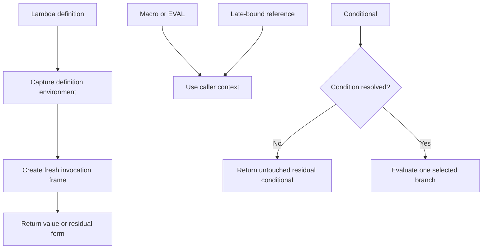
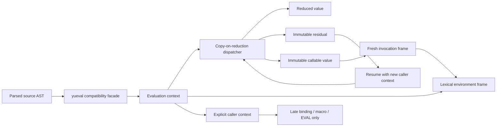
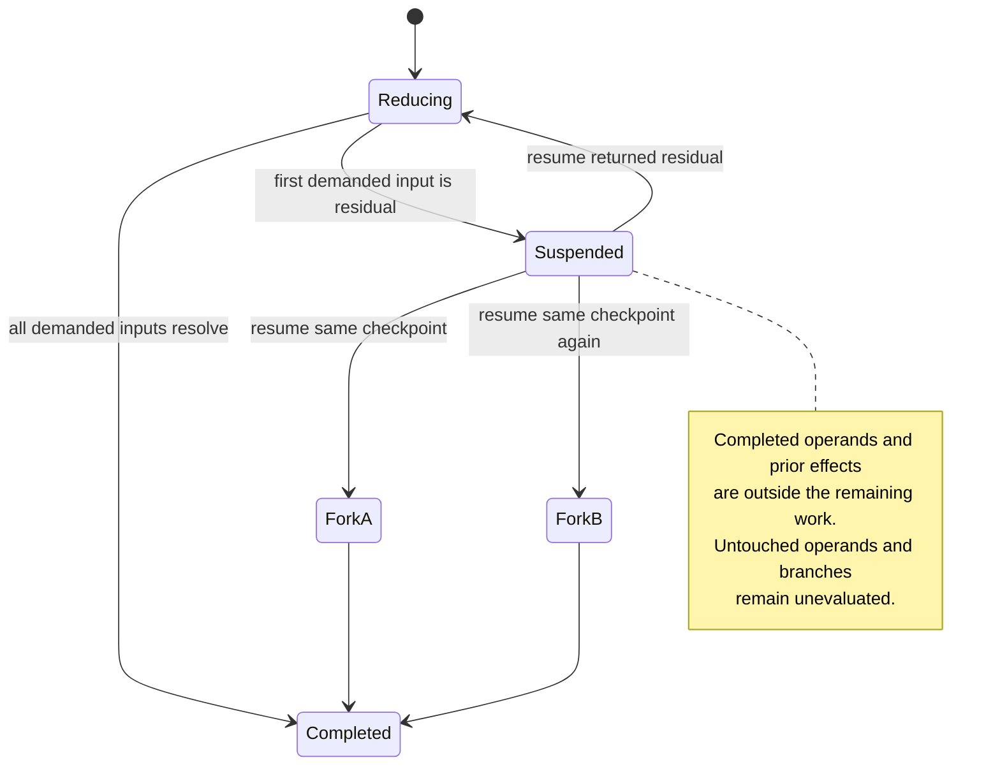

# Yueval Language Semantics - Plan

## Goal Capsule

- **Objective:** Replace `yueval`'s mutable hybrid evaluation model with explicit lexical function semantics, deterministic reduction, and scalable closure invocation while retaining the language's intentional metaprogramming features.
- **Product authority:** The confirmed decisions in this contract override the experimental eval/apply behavior described by the current evaluator TODO. Existing documentation, examples, and evaluator fixtures remain authoritative for behavior not changed here.
- **Open blockers:** None. The release accepts documented compatibility changes for code that depends on accidental dynamic scope or the evaluator's current speculative conditional and effect behavior.
- **Execution profile:** Characterization-first internal refactor with one semantic cutover; preserve the parser surface and `yueval(ast, env)` entry point, and do not add a legacy evaluator mode.
- **Stop conditions:** Stop and investigate if an output change cannot be traced to this Product Contract, source-location provenance regresses, or closure call-state creation or a parameter-only invocation copies, enumerates, or scales with unrelated ancestor bindings. Measure demand-driven lexical lookup separately from call setup.
- **Tail ownership:** Implementation owns focused and full regression verification, example regeneration checks, migration documentation, and package validation. Version tagging and publication remain release-owner actions after this plan is complete.

---

## Product Contract

### Summary

`yueval` will evaluate immutable source forms under a defined binding and evaluation model. Lambda functions use lexical scope, while macros, `EVAL`, and late-bound references retain explicit caller-context behavior.

The implementation will replace the evaluator internals in place with structurally shared environments, immutable callable and residual values, and explicit evaluation context. The plan covers the complete contract, including focused semantic characterization, migration diagnostics, compatibility verification, and repeatable scaling evidence; unrelated parser and module cleanup remains deferred.

### Problem Frame

The evaluator currently combines reduction, application, environment management, and in-place AST rewriting. Reusing a mutable closure depends on deep-copying its value, and that copy recursively includes the complete parent environment and all earlier definitions.

This produces work proportional to the number of reachable bindings for every function lookup. A diagnostic workload with the same number of definitions and calls showed near-quadratic growth, while profiling attributed about 98% of evaluation time to deep copying.

| Definitions | Calls | Current evaluation time |
|---:|---:|---:|
| 25 | 25 | 19 ms |
| 50 | 50 | 75 ms |
| 100 | 100 | 297 ms |
| 200 | 200 | 1.26 s |
| 400 | 400 | 5.27 s |

The same model also produces hybrid scope: reducible free names may be captured during definition, while names in deferred forms may resolve in the caller. An unresolved conditional reduces both branches, so an unselected branch may perform a side effect or raise an exception.

### Key Decisions

- **Lexical lambda scope:** A lambda captures the environment where it is defined. Invocation never replaces that captured environment with the caller's environment.
- **Explicit dynamic surfaces:** Macros and `EVAL` expand in the caller context. Late-bound references remain the explicit language mechanism for deferred caller-context name resolution.
- **Immutable reduction:** Source AST nodes and closure templates are reusable values. Evaluation returns a value or a new residual form rather than changing its input.
- **Deterministic application:** Ordinary applications evaluate the callee first and arguments left to right exactly once. Special forms own any intentional deviation from this rule.
- **Non-speculative conditionals:** An unresolved condition remains residual without reducing either branch. A resolved condition evaluates only its selected branch.
- **Intentional compatibility changes:** Programs that rely on accidental dynamic lookup must pass values explicitly or adopt late binding; a legacy scope mode is not part of this release. Release documentation also identifies externally observable changes to conditional evaluation and effect ordering.

### Operational Semantics

**Caller context**

- The caller environment of a particular application, macro invocation, or `EVAL` is the active evaluation environment when that operation begins.
- An ordinary lambda uses its captured lexical environment and fresh invocation frame for regular references. It may consult caller context only through an explicit late-bound form.
- Partial application retains the captured lexical environment and the arguments bound so far, but not the caller environment of an earlier application step.
- A late-bound reference resolves in the caller environment of the application or residual resumption that first requires its value.
- Macro arguments, macro expansion, and evaluation of the expanded form use the macro invocation's caller environment.
- The input to `EVAL` and the form produced by parsing that input use the environment in which `EVAL` executes.

**Residual continuation**

- A residual form is an immutable suspended computation. Its representation shall preserve the observable state described here without prescribing whether the implementation stores an environment, substitutes values, or uses another immutable representation.
- Regular references retain the lexical bindings in effect when the residual was created. A later resumption environment is visible only to explicit late-bound references, macros, and `EVAL`.
- Already reduced operands remain represented by their values, and already committed effects are absent from the remaining work. Untouched operands and branches remain unevaluated.
- Resuming a residual continues the same evaluation. Evaluating the original source AST again starts a separate evaluation with independent effects.

### Requirements

**Binding and closure semantics**

- R1. An ordinary lambda shall capture the visible environment at its definition point.
- R2. Each lambda invocation shall create a fresh parameter frame whose parent is the captured definition environment.
- R3. Partial application shall produce a new callable value containing the captured lexical environment and arguments bound so far without changing the source closure or retaining the caller environment of an earlier application step.
- R4. Recursive and mutually recursive `SET` and `LET` bindings shall make every binding in the group visible to the closures created for that group.
- R5. A late-bound reference shall resolve only through the explicit late-binding rules of the language, using the caller environment of the application or residual resumption that first requires its value.
- R6. Macro arguments, expansion, and expanded forms shall use the macro invocation environment; `EVAL` input and its parsed form shall use the environment in which `EVAL` executes.

**Evaluation and effects**

- R7. `yueval` shall not mutate the parsed AST or any reusable closure template supplied to it.
- R8. Evaluation shall return either a fully reduced value or a new immutable residual form that preserves lexical context, completed reductions, and committed effects as defined by the residual-continuation rules.
- R9. An ordinary application shall evaluate its callee first and its arguments from left to right exactly once.
- R10. Lazy built-ins, macros, `EVAL`, and late-bound forms may defer evaluation only through their documented special-form contracts.
- R11. An unresolved conditional shall remain residual without evaluating either branch.
- R12. A resolved conditional shall evaluate exactly one branch.
- R13. `SET`, `LET`, and `EMIT` effects shall occur in source evaluation order. Within one evaluation and every continuation of a residual it creates, each effectful source occurrence shall execute at most once; a separate evaluation started from the original AST executes that occurrence independently.
- R14. Separate evaluations of the same immutable AST with equivalent initial environments shall produce equivalent results and effect sequences without changing the AST between evaluations.

**Compatibility and performance**

- R15. Computed callees, partial application, named and default parameters, variadic parameters, late binding, recursion, list iteration, numeric subscripting, macros, and dynamic `EVAL` shall remain supported.
- R16. Existing truthiness rules and the treatment of unbound atoms as textual identifiers shall remain unchanged.
- R17. A closure invocation shall not copy or traverse unrelated ancestor bindings as part of creating its local call state.
- R18. Evaluation cost for repeated calls shall scale with the evaluated forms and call-local state rather than the total size of the preceding environment.
- R19. Existing evaluator fixtures and generated examples shall retain their outputs unless an expectation directly conflicts with a requirement in this contract.
- R20. Evaluation failures shall retain the current source-location diagnostics for source forms, macro expansions, and dynamic evaluation.
- R21. Release documentation shall identify every externally observable semantic change introduced by this contract, including lexical scope, conditional evaluation, and effect ordering, and shall provide migration guidance where existing programs can require changes.
- R22. An opt-in runtime migration diagnostic shall report a regular free reference that is absent from a lambda's lexical environment but present in its invocation caller environment, without resolving the reference dynamically. The report shall include source location, recommend explicit argument passing or late binding, and state that only executed paths are checked.

### Key Flows

- F1. Lexical function invocation
  - **Trigger:** Evaluation encounters an ordinary lambda definition and later applies the resulting closure.
  - **Steps:** Capture the definition environment, evaluate ordinary arguments once, create a fresh invocation frame, and reduce the body under that frame.
  - **Outcome:** The call cannot observe caller-only shadowing unless the source uses explicit late binding.
  - **Covered by:** R1, R2, R3, R5, R7, R9

- F2. Recursive binding
  - **Trigger:** `SET` or `LET` binds one or more closures that refer to names in the same binding group.
  - **Steps:** Establish the complete binding group, create closures that capture it, and allocate an independent invocation frame for each recursive call.
  - **Outcome:** Self-recursion and mutual recursion work without copying or mutating prior invocations.
  - **Covered by:** R2, R4, R7, R17

- F3. Deferred conditional
  - **Trigger:** A conditional depends on a value that is not yet reducible.
  - **Steps:** Preserve the condition, both untouched branches, applicable lexical context, completed reductions, and committed effects in an immutable residual form; after the condition resolves, evaluate only the selected branch.
  - **Outcome:** An unresolved or unselected branch cannot perform effects or raise an exception, and resumption cannot repeat previously completed work.
  - **Covered by:** R8, R11, R12, R13

- F4. Caller-context metaprogramming
  - **Trigger:** Evaluation expands a macro, runs `EVAL`, or resolves an explicit late-bound reference.
  - **Steps:** Use the environment of the specific macro invocation, `EVAL`, application, or residual resumption that demands the dynamic operation without retaining caller environments from earlier partial applications.
  - **Outcome:** Dynamic metaprogramming remains available through visible language constructs.
  - **Covered by:** R5, R6, R10, R15

### Acceptance Examples

- AE1. Lexical capture
  - **Covers:** R1, R2
  - **Given:** `x` is `1` when `f` is defined and a caller later shadows `x` with `2`.
  - **When:** The caller invokes `f`.
  - **Then:** A regular reference to `x` inside `f` resolves to `1`.

- AE2. Explicit late binding
  - **Covers:** R5
  - **Given:** A function intentionally declares a caller-context dependency using late binding.
  - **When:** A caller supplies or exposes the late-bound value `2`.
  - **Then:** The function resolves `2` without changing regular lambda scope.

- AE3. Reusable partial application
  - **Covers:** R3, R7, R14, R15
  - **Given:** A three-argument function is partially applied to its first argument.
  - **When:** The partial closure is invoked more than once with different remaining arguments.
  - **Then:** Each result uses the original bound argument and independent call-local values.

- AE4. Recursive isolation
  - **Covers:** R2, R4
  - **Given:** A factorial function recursively refers to its own binding.
  - **When:** It evaluates factorial of `6`.
  - **Then:** It returns `720`, and no recursive invocation overwrites another invocation's parameter frame.

- AE5. Unresolved branch safety
  - **Covers:** R8, R11, R13
  - **Given:** A conditional has an unresolved late-bound condition and an alternative that would divide by zero.
  - **When:** The conditional is reduced before its condition becomes available.
  - **Then:** It returns a residual conditional without raising and without changing either branch.

- AE6. Selected branch exclusivity
  - **Covers:** R12, R13
  - **Given:** One conditional branch performs an `EMIT` effect and the other raises an exception.
  - **When:** The condition selects the effectful branch.
  - **Then:** The effect occurs once and the unselected exception is not evaluated.

- AE7. Stable AST reuse
  - **Covers:** R7, R14
  - **Given:** A parsed AST contains function definitions, applications, and a conditional.
  - **When:** It is evaluated twice under equivalent fresh environments.
  - **Then:** Both results are equivalent and the AST representation is unchanged after both evaluations.

- AE8. Environment-independent invocation cost
  - **Covers:** R17, R18
  - **Given:** Unrelated definitions are inserted before a frequently called closure.
  - **When:** The closure is invoked the same number of times before and after those additions.
  - **Then:** Invocation does not clone those unrelated definitions, and measured work does not grow in proportion to their count.

- AE9. Mutual recursive binding group
  - **Covers:** R2, R4, R7
  - **Given:** Each of `SET` and `LET` binds an `even` and `odd` closure together, and each closure calls the other for its recursive step.
  - **When:** Both entry points are invoked with values that require calls in both directions.
  - **Then:** Each pair returns the expected parity results, and every closure sees the complete binding group.

- AE10. Late binding after partial application
  - **Covers:** R3, R5
  - **Given:** A function with a regular lexical reference and an explicit late-bound reference is partially applied under one caller and completed under another caller that shadows both names.
  - **When:** The completed call first requires the late-bound value.
  - **Then:** The regular reference uses the definition environment, the late-bound reference uses the completing call's environment, and the earlier partial-application caller is not retained.

- AE11. Macro and `EVAL` caller context
  - **Covers:** R6, R10
  - **Given:** A macro and an `EVAL` input producer are defined outside a lambda whose invocation frame shadows a referenced name.
  - **When:** The lambda invokes the macro and executes `EVAL`.
  - **Then:** Macro arguments, the expanded macro form, the `EVAL` input, and its parsed form use the invocation frame while ordinary lambda references remain lexical.

- AE12. Residual lexical context
  - **Covers:** R2, R5, R8
  - **Given:** A lambda creates a residual conditional whose branch contains both a regular reference to an invocation-local value and an explicit late-bound reference.
  - **When:** The residual is resumed after the lambda invocation has returned and under a caller that shadows both names.
  - **Then:** The regular reference retains the original invocation value and the late-bound reference uses the resumption caller.

- AE13. Residual effect continuity
  - **Covers:** R8, R9, R13, R14
  - **Given:** An application completes an effectful operand before a later operand becomes residual.
  - **When:** The residual is resumed more than once in the same continuation chain and the original AST is also evaluated separately.
  - **Then:** The completed effect occurs once in the continuation chain and once again in the independent evaluation of the original AST.

- AE14. Scope migration diagnostic
  - **Covers:** R16, R20, R22
  - **Given:** An ordinary lambda contains a regular free reference that is absent from its lexical environment but present in its invocation caller environment.
  - **When:** The lambda runs with migration diagnostics enabled.
  - **Then:** Evaluation retains lexical semantics and reports the reference with source location, executed-path limitation, and explicit-argument or late-binding guidance.

### Success Criteria

- All focused semantic examples above are covered by named tests.
- The 13 existing evaluator records continue to pass except for any expectation explicitly superseded by this contract.
- Parser output can be reused for multiple evaluations without structural mutation.
- A deterministic allocation or traversal test proves that closure invocation does not copy ancestor environments.
- A scaling benchmark distinguishes the new behavior from the current quadratic definitions-by-calls pattern.
- Migration diagnostics identify an exercised caller-only free reference without changing its lexical result.
- Release notes identify the externally observable changes to lexical scope, conditional evaluation, and effect ordering; they include a lexical-scope migration example and applicable dynamic-lookup replacements.

### Scope Boundaries

- Macro hygiene is not introduced; macros remain explicit caller-context expansion.
- The surface syntax, truthiness rules, unbound-atom behavior, and trusted-input security boundary are unchanged.
- Removing late binding, macro expansion, list application, numeric application, or `EVAL` is out of scope.
- Stricter errors for surplus positional arguments or repeated named arguments are deferred.
- A legacy dynamic-scope compatibility mode is not included.
- Migration diagnostics are opt-in and runtime-only; complete static detection of unexecuted dynamic-scope dependencies is not included.
- Broad parser changes and unrelated evaluator cleanup are excluded unless required to satisfy this contract.

### Dependencies and Assumptions

- The new release may contain the confirmed compatibility break from hybrid dynamic lookup to lexical lambda scope.
- Explicit argument passing and the existing late-binding feature are sufficient migration mechanisms for known dynamic-scope use cases, while opt-in diagnostics provide source-local guidance for exercised caller-only references.
- Macro and `EVAL` caller-context behavior is intentional and remains part of the language identity.
- Existing evaluator fixtures provide the compatibility baseline, but focused semantic tests take precedence where the legacy suite does not isolate a rule.

### Sources and Research

- `src/yupp/pp/yugen.py:2604` — recursive environment deep-copy behavior.
- `src/yupp/pp/yugen.py:3091` — eval/apply reducer and its experimental-semantics warning.
- `src/yupp/pp/yugen.py:3212` — application evaluation order and in-place rewriting.
- `src/yupp/pp/yugen.py:3485` — variable lookup deep-copy boundary.
- `src/yupp/pp/yugen.py:3518` — closure parent rebinding and body reduction.
- `src/yupp/pp/yugen.py:3637` — unresolved conditional branch reduction.
- `tests/test_evaluator.py:18` — exact legacy evaluator characterization records.
- `doc/README.md:44` — documented lambda model and language examples.
- `doc/README.md:201` — documented late-bound parameter behavior.

---

## Planning Contract

**Product Contract preservation:** Product requirements and stable R/F/AE IDs are unchanged; the Summary only records the confirmed implementation scope.

### Key Technical Decisions

- **KTD1 — Preserve the external evaluator boundary.** Keep the `yupp.pp.yugen` import path, positional `yueval(ast, env, depth=0)` calling contract, accepted `ENV` inputs, terminal result behavior, recursive trace depth, and exception/source-provenance conventions. Calling `yueval(ast)` starts with isolated top-level evaluation state each time. New context, closure, and residual implementation classes remain private unless characterization proves a concrete representation is an existing compatibility surface. Replace the internals rather than exposing a second evaluator or compatibility mode.
- **KTD2 — Keep the first refactor inside the existing evaluator module.** Co-location is a release-sequencing boundary, not a rejection of future extraction: private dependencies flow from the compatibility façade to evaluation context and then to reducer/runtime values, while `src/yupp/pp/yup.py` keeps its current evaluator imports. Moving the parser, AST hierarchy, or evaluator wholesale now is rejected because it combines a module-boundary migration with the semantic migration and introduces circular-dependency and fixture risk before the new responsibilities stabilize.
- **KTD3 — Use structurally shared environment frames with separated state.** A frame has a stable parent reference and owns only local binding references. Recursive publication uses write-once cells; `EMIT` and other continuation effects use continuation-local versioned state or an explicit copy-on-fork snapshot, never generally mutable captured cells. Call setup is proportional to parameters, supplied arguments, and changed local state, with zero copying or enumeration of captured ancestors. A regular lookup may follow only the path demanded by its referenced name and may memoize the resolved binding reference without changing semantics.
- **KTD4 — Separate callable templates from invocation state.** A lambda closure records the source body, parameter specification, definition environment, definition-time default values, and provenance as reusable data. Every positional, named, variadic, or partial application produces fresh call state or a new partial callable; it never assigns into the source closure.
- **KTD5 — Make evaluation context and lookup mode explicit.** The private context separately records the lexical frame, current application/resumption caller, any already-started macro/`EVAL` operation, continuation state version, diagnostics, and trace depth. Regular references search only the invocation frame and lexical chain. Late-bound references search only the caller component attached to the operation that demands them. Macro and `EVAL` receive operation context explicitly instead of changing an environment parent.
- **KTD6 — Use copy-on-reduction values and residuals.** The reducer constructs results from unchanged inputs. Completed subexpressions are represented by their values, untouched subexpressions retain their source nodes, and a suspended computation records the lexical environment, dynamic-operation context where applicable, completed work, and remaining work without modifying the source AST.
- **KTD7 — Preserve written application order.** The callee is reduced once, then supplied positional and named argument expressions are reduced once in their combined source order. The parser may add compatibility-neutral ordering metadata to `APPLY`, while its existing `args`, `named`, representation, equality, and fixture-visible shape remain stable. Reduction stops at the first residual operand and leaves later operands untouched.
- **KTD8 — Preserve definition-time defaults.** Default expressions retain current externally observable timing: evaluate once while creating the lambda under its definition environment. A residual default retains that lexical context and is demanded when the omitted parameter requires it; it never consults the invocation caller as a regular lookup source.
- **KTD9 — Construct recursive groups in two phases.** One `SET` or `LET` lvalue—single name or destructuring list—defines one binding group. Predeclare write-once cells in one frame, evaluate the right-hand side once with that frame visible to closures, then publish all values together. A demanded uninitialized cell remains residual and cannot fall through to an outer or caller binding. Callable equality, representation, tracing, and diagnostics do not recursively descend through the resulting frame/closure cycle.
- **KTD10 — Define residual forks without a hidden global effect ledger.** A residual captures a continuation-state version rather than live mutable effect cells. Effects completed before its checkpoint are absent from remaining work. Following each newly returned residual forms one chain; resuming the same earlier residual more than once snapshots independent branches, so later effects may occur once per branch while earlier effects do not repeat.
- **KTD11 — Retain operation context only for an operation already in progress.** A macro expansion or `EVAL` that suspends retains the caller component captured when that operation began. A macro, `EVAL`, or late-bound reference first reached after resumption uses that resumption caller, including when nested inside an older retained operation. Caller contexts from completed partial-application steps are never retained.
- **KTD12 — Integrate migration warnings with existing configuration.** Add a default-off evaluator/configuration flag and matching CLI warning control using the existing logging and `.yuconfig` patterns. Report an executed caller-only regular reference once per source occurrence per top-level evaluation, retain macro/`EVAL` inclusion provenance, and perform only a presence check—the lexical result remains unchanged.
- **KTD13 — Make structural performance evidence authoritative.** Blocking tests use a closure body that needs no ancestor lookup and prove constant call-frame creation plus zero captured-ancestor copy/enumeration as unrelated bindings grow. Demand-driven lexical lookup is measured separately so its referenced-name path is not confused with call setup; repeated calls may use a non-semantic binding-reference cache. Comparative counter and timing series are recorded for release evidence, but elapsed-time thresholds do not gate cross-platform CI.
- **KTD14 — Keep cyclic runtime graphs out of structural diagnostics.** Recursive closures can point through write-once cells back to their captured frame. Equality, `repr`, trace rendering, and error formatting compare or display stable callable/frame identity and local summaries rather than recursively traversing captured ancestry. Parsed AST representation and equality remain structural and unchanged.

### High-Level Technical Design

The compatibility façade continues to own tracing and exception normalization. The internal context distinguishes lexical lookup, dynamic lookup, evaluation-chain identity, and optional diagnostic reporting. Reducer branches return new values rather than updating `APPLY`, `LAMBDA`, `COND`, `TEXT`, closure, or residual objects supplied by their caller.

| Context component | Lifetime | Visible to |
|---|---|---|
| Lexical frame | Closure definition through every invocation/partial callable | Regular references |
| Invocation frame | One fresh call or partial-call result | Parameters, then regular references |
| Current caller | One application or resumption step | Newly demanded late-bound references and newly started dynamic operations |
| Dynamic operation context | From macro/`EVAL` start through its completion or residuals | That macro expansion or `EVAL` only |
| Continuation-state version | One residual checkpoint and its descendant chain | `SET`/`LET`/`EMIT` state and fork snapshots |
| Diagnostic occurrence set | One top-level evaluation and its continuation descendants | Opt-in migration reporting only |

### System-Wide Impact

- **Evaluator runtime:** `ENV`, closure classes, `SET_CLOSURE`, `COND_CLOSURE`, and `yueval` stop relying on mutable parent rebinding and recursive `deepcopy`; recursive publication and continuation-local effect state become distinct mechanisms.
- **Parser/AST seam:** `APPLY` gains only the minimum immutable ordering information needed to preserve mixed named/positional source order; parser syntax and fixture-visible AST representation stay stable.
- **Configuration/CLI:** the opt-in scope-migration warning follows the established constants, configuration merge, CLI flag, and logger pipeline.
- **Tracing and diagnostics:** residual reconstruction and dynamically parsed forms preserve existing source, macro-inclusion, and `EVAL` provenance.
- **Tests and examples:** focused semantic tests take precedence for deliberate compatibility changes; legacy records, imports, codec behavior, traceback tests, and generated examples remain the broad regression net.
- **Packaging:** no runtime dependency or packaging-layout change is required. The existing Python 3.11–3.14 CI and artifact-validation matrix remains applicable.

### Risks and Mitigations

| Risk | Consequence | Mitigation |
|---|---|---|
| Mutable AST behavior is accidentally preserved in a reducer branch | Reusing an AST or residual changes later results | Hash and compare source ASTs around repeated evaluation; cover every composite reducer family with reuse tests |
| Recursive cells leak an outer value before initialization | Recursion becomes silently scope-dependent | Use an explicit uninitialized state that blocks lookup fallback; test self- and mutual-recursive groups plus premature reads |
| Recursive frame/closure cycles are traversed by equality or diagnostics | Representation, tracing, or errors recurse indefinitely | Use cycle-safe identity/local summaries for runtime values; test `repr`, equality, tracing, and failures for self- and mutual recursion |
| Runtime value cloning changes list or `EMIT` alias behavior | Existing programs observe different iteration/effect results | Characterize mutable value boundaries before replacing `deepcopy`; share immutable closures/frames while copying only value payloads whose current semantics require independence |
| Two residual forks share live effect state | Consuming or updating one branch changes the other | Capture continuation-state versions and verify independent `EMIT` consumption/update after forking the same checkpoint |
| Mixed named and positional arguments lose written order | Effects and residual boundaries are reordered | Record parser-time order without changing syntax or fixture-visible representation; test interleaved argument effects |
| Macro or `EVAL` suspension drops provenance or caller context | Dynamic features resolve names incorrectly or report misleading locations | Carry explicit operation context and inclusion provenance in residual state; extend traceback tests through macro and `EVAL` paths |
| Wall-clock measurements are noisy across CI platforms | Correct work fails intermittently or regressions pass | Gate on structural counts/forbidden ancestor copies; retain timing only as comparative release evidence |

### Execution-Time Unknowns

- The exact private class names and helper boundaries may change while implementing the evaluator, provided the environment, callable, context, residual, and compatibility responsibilities remain separated as described.
- Existing mutable value cases beyond `LIST` and `EMIT` must be classified while characterization tests are added. Copy only the payloads required for existing value independence; do not reintroduce environment-chain copying.
- If compatibility-neutral application-order metadata cannot be added without changing fixture-visible representations, stop and document the smallest parser/fixture change required before updating snapshots.

### Deferred to Follow-Up Work

- Splitting the parser, AST classes, and evaluator into a new package or broad module hierarchy.
- General modernization or stylistic cleanup of unrelated branches in `src/yupp/pp/yugen.py`.
- Static analysis for unexecuted dynamic-scope dependencies.
- Macro hygiene, a legacy dynamic-scope engine, and stricter surplus/repeated argument errors.

### Planning Research

- The problematic model dates to the evaluator's initial repository introduction: closure parent rebinding, environment-recursive `deepcopy`, and mutable reduction arrived as one design rather than as a later isolated optimization.
- Profiling of the definitions-by-calls workload attributed roughly 98% of evaluation time to `deepcopy`; sharing the parent chain in a diagnostic prototype preserved all legacy evaluator records and reduced the 400-definition/400-call case from about 5.27 seconds to about 33 milliseconds.
- Removing copying alone is not semantically safe: reusable closure calls then share parameter assignments. Fresh invocation frames and immutable callable values are therefore required together with structural sharing.
- The existing parser stores positional and named arguments separately, so combined written order must be retained explicitly to implement R9 without a broad grammar change.
- The repository has no prior `CONCEPTS.md` or `docs/solutions/` guidance for this subsystem. Current code, language documentation, fixtures, generated examples, and git history are the implementation precedents.

---

## Implementation Units

### U1 — Freeze preserved evaluator behavior and measurement fixtures

**Goal:** Establish a focused, reviewable test boundary before replacing the evaluator internals.

**Requirements:** R15, R16, R19, R20. Prepares evidence for R7, R14, R17, and R18.

**Flows:** Characterizes the preserved surfaces used by F1–F4 without claiming the corrected outcomes before their owning units.

**Dependencies:** None.

**Files:**

- `tests/conftest.py`
- `tests/test_evaluator.py`
- `tests/test_evaluator_characterization.py` (new)
- `tests/test_evaluator_scaling.py` (new)
- `script/benchmark_yueval.py` (new)

**Approach:**

- Add evaluation helpers that isolate top-level state, capture AST representation before/after evaluation, and collect logger/trace output without depending on new evaluator-private types.
- Preserve the existing exact legacy records and error-prefix tests as the compatibility baseline.
- Characterize currently supported closure reuse, partial application, definition-time defaults, mutable list/`EMIT` values, macros, `EVAL`, late binding, tracing, and source locations only where the Product Contract preserves the behavior.
- Record—not approve—the current AST mutation, scope defect, speculative conditional behavior, ancestor-copy counters, and definitions-by-calls timing as baseline measurements consumed by later units.
- Define the scenario names and shared fixtures for AE1–AE14, but add each desired-behavior assertion in its implementation-owning unit so U1 remains green and auditable.

**Execution note:** Characterization-first. Capture preserved mutable-value, tracing, and dynamic-feature behavior before changing runtime objects.

**Test Scenarios:**

- Re-run the exact legacy evaluator records and error cases with the new helpers and verify no baseline output or diagnostic drift.
- Invoke reusable and partial closures repeatedly and record the supported results that current deep copying protects.
- Create a default expression under one lexical value and verify its current definition-time result independently of later caller shadowing.
- Exercise macro, `EVAL`, late binding, list application, numeric subscripting, variadics, defaults, and named arguments against their current supported outputs.
- Capture `repr`, equality, tracing, and source-location behavior for non-recursive runtime values, plus existing list and `EMIT` independence/alias observations.
- Call `yueval(ast)` twice without an explicit environment in one process and record any shared top-level state for U2/U3 isolation coverage.
- Run the definitions-by-calls benchmark and structural counters at the Product Contract workload sizes, storing the baseline series and classification in benchmark output.

**Verification:** All characterization assertions are green on the current evaluator, baseline measurements are reproducible, and no desired semantic failure is hidden behind an expected-failure marker or an altered legacy fixture.

### U2 — Introduce shared lexical frames and immutable callable state

**Goal:** Replace mutable closure ownership and recursive environment copying with reusable lexical values and fresh invocation state.

**Requirements:** R1–R4, R17, R18; AE1, AE3, AE4, AE8, AE9. Prepares the callable-state portions of R7 and R14 for completion in U3.

**Flows:** F1 (lexical invocation) and F2 (recursive binding).

**Dependencies:** U1.

**Files:**

- `src/yupp/pp/yugen.py`
- `tests/test_evaluator_semantics.py`
- `tests/test_evaluator_scaling.py`

**Approach:**

- Refactor `ENV` into stable parent-linked frames whose local bindings can be created or updated without copying ancestry.
- Introduce explicit write-once cells for recursive groups and distinguish uninitialized state from an ordinary unbound atom or late-bound reference.
- Make lambda and partial callable values immutable with respect to body, captured frame, defaults, bound arguments, late-binding declaration, and call provenance.
- Treat callable values and captured frames as shared runtime values; preserve value-level copying only where characterization proves mutable payload independence is observable.
- Create fresh invocation frames for every call and return a new callable value for every partial application.
- Adapt `SET`/`LET` group construction to publish through the new cells; U3 subsequently preserves this already-green F2 behavior while converting binding reduction to copy-on-reduction.
- Keep parsed AST representation/equality compatible, but make runtime callable/frame representation, equality, tracing, and failures cycle-safe rather than structurally descending through captured frames.
- Establish the call-setup counter boundary: parameters, supplied arguments, local writes, parent enumeration/copy attempts, and demanded-name lookup traversal are reported separately.

**Test Scenarios:**

- Invoke the same one-argument closure with `1` and `2` and verify distinct results without copying the captured parent or changing the callable.
- Reuse one partial application for multiple completions and verify bound arguments are retained while later arguments remain independent.
- Shadow a free regular name in the caller and verify lexical lookup remains at the definition value (F1 / AE1); late-bound completion is owned by U4.
- Build single, destructured, self-recursive, and mutually recursive binding groups; verify every closure captures the complete group.
- Demand an uninitialized recursive member and verify reduction suspends rather than consulting an outer binding with the same name.
- Call `repr`, equality, trace rendering, and an error path on self- and mutually recursive closures; verify each terminates with stable provenance.
- Place hundreds of unrelated bindings before a parameter-only closure and verify constant frame creation plus zero parent enumeration/copy during call setup (AE8); measure a demanded free-name lookup separately.
- Invoke `yueval(ast)` repeatedly with omitted and explicit environments; verify fresh top-level call/diagnostic state and supported `ENV` inputs without cross-evaluation leakage.

**Verification:** F1/F2 lexical, partial-application, recursion, cycle-safe diagnostic, default-call isolation, and structural call-setup scenarios pass; `ENV.__deepcopy__` is no longer part of normal variable lookup or closure invocation.

### U3 — Convert core reduction to immutable, ordered evaluation

**Goal:** Make ordinary callee/argument and composite-form reduction deterministic without rewriting parsed nodes.

**Requirements:** R7, R9, R14, R16, R20; AE7.

**Flows:** F1 ordinary-application ordering and the immutable-evaluation prerequisite for F3.

**Dependencies:** U2.

**Files:**

- `src/yupp/pp/yugen.py`
- `tests/test_parser.py`
- `tests/test_evaluator.py`
- `tests/test_evaluator_semantics.py`
- `tests/test_traceback.py`

**Approach:**

- Add the explicit internal evaluation context and minimal value/residual protocol behind the existing `yueval` façade and trace decorator.
- Convert ordinary composite branches—text, lists, applications, variables, lambdas, already-established binding groups, infix forms, embedding, and trimming—to construct outputs from unchanged inputs. Preserve U2's F2 binding semantics while changing their reducer representation.
- Preserve combined source order for positional and named operands with compatibility-neutral `APPLY` metadata; keep current AST representation and equality stable.
- Stop application reduction at the first demanded residual, retain completed operands as values, and retain later operands as untouched forms.
- Evaluate default values at lambda definition under lexical context, preserving any immutable residual default until demanded.
- Start every façade call without a residual from isolated top-level continuation and diagnostic state; calls with a residual continue the state carried by that checkpoint.

**Test Scenarios:**

- Use an effectful callee and interleaved effectful arguments; verify callee-first, combined left-to-right ordering, and one evaluation per supplied expression.
- Make the second operand residual and the third operand exception-raising; verify the third operand is untouched until a continuation demands it.
- Evaluate the same original AST independently through explicit and omitted environments; verify equivalent results, independent top-level state, and an unchanged AST (F1 / AE7).
- Re-run parser snapshot/hash coverage and verify ordering metadata does not alter fixture-visible AST shape.
- Raise errors from ordinary source forms after copy-on-reduction and verify existing file, line, caret, type, and diagnostic prefix behavior.

**Verification:** Immutable-AST, ordered-application, first-residual suspension, default-call isolation, parser snapshot, F2 preservation, and ordinary traceback scenarios pass without input mutation.

### U7 — Implement residual continuations, conditionals, and fork-local effects

**Goal:** Complete F3 with immutable checkpoints that preserve completed work and isolate effect state across continuation forks.

**Requirements:** R8, R11–R14; AE5–AE7, AE13. Provides the regular-reference half of AE12 for U4.

**Flows:** F3 (deferred conditional and continuation effects).

**Dependencies:** U3.

**Files:**

- `src/yupp/pp/yugen.py`
- `tests/test_evaluator_semantics.py`
- `tests/test_evaluator_scaling.py`
- `tests/test_traceback.py`

**Approach:**

- Represent a residual checkpoint with completed values, untouched forms, retained lexical frames, an optional in-progress dynamic-operation context, and a continuation-state version.
- Store `SET`, `LET`, and `EMIT` effects in continuation-local state. Recursive publication remains in U2 write-once cells; mutable continuation effects never reuse those cells.
- Snapshot or persist effect state when the same residual is resumed more than once so each branch observes the checkpoint state and subsequent updates independently.
- Convert conditional reduction to suspend on an unresolved condition with both branches untouched, then evaluate only the selected branch.
- Exclude committed operands and effects from remaining residual work and propagate trace/error provenance through every returned checkpoint.

**Test Scenarios:**

- Evaluate an unresolved conditional with a divide-by-zero branch and an `EMIT` branch; verify neither branch runs before selection (F3 / AE5).
- Resolve the condition to each truth value and verify only the selected branch runs and each selected effect occurs once (F3 / AE6).
- Suspend after an effectful operand, follow successive returned residuals, and verify completed work never repeats in that chain (AE13).
- Resume the same earlier checkpoint twice, consume and update an `EMIT` list in both branches, and verify independent later effects with identical prior checkpoint state.
- Resume after the creating lambda returns and verify its regular invocation-local value persists; U4 adds the late-bound resumption half of AE12.
- Evaluate the original source AST separately after completing and forking residuals; verify independent effects and unchanged source structure (AE7 / AE13).
- Raise an error after multiple resumptions and verify the original source/macro provenance remains intact.

**Verification:** F3 condition, continuation-chain, independent-fork, regular lexical retention, AST reuse, effect isolation, and residual traceback scenarios pass with no hidden process-global effect ledger.

### U4 — Restore explicit dynamic surfaces on the new evaluator

**Goal:** Preserve intentional caller-context flexibility without allowing it to leak into ordinary lambda lookup.

**Requirements:** R3, R5, R6, R8, R10, R15, R20; AE2, AE10–AE12.

**Flows:** F4 and the dynamic-resumption seam of F3.

**Dependencies:** U7.

**Files:**

- `src/yupp/pp/yugen.py`
- `tests/test_evaluator_semantics.py`
- `tests/test_imports.py`
- `tests/test_traceback.py`

**Approach:**

- Route late-bound lookup through the explicit caller context of the application or resumption that first demands the value.
- Route macro argument reduction, textual substitution, parsing, and expanded-form evaluation through the macro invocation context.
- Route `EVAL` input reduction and parsed-form evaluation through the context in which that `EVAL` begins.
- Preserve an already-started macro or `EVAL` context across residual suspension; use the resumption caller only for dynamic operations first reached after resumption.
- Ensure ordinary lambdas created or invoked inside macro/`EVAL` work remain lexically scoped unless their source uses explicit late binding.
- Preserve source inclusion stacks and declaration/call provenance through dynamically generated forms.

**Test Scenarios:**

- Invoke a function with an explicit late-bound dependency and verify it reads the current application caller without changing regular lexical scope (F4 / AE2).
- Partially apply a function under one caller, complete it under another, and verify only the completing caller is visible to a newly demanded late-bound value (F4 / AE10).
- Begin a macro expansion, suspend it, resume under a shadowing caller, and verify the in-progress macro retains its invocation context.
- Reach a second macro only after resumption and verify that new operation sees the resumption caller.
- Perform the equivalent pair of in-progress/newly-reached scenarios for `EVAL`.
- Nest a newly started macro or `EVAL` inside an older retained operation and verify the outer context cannot become the new operation's caller.
- Resume a lambda-created residual under caller shadowing and verify the regular value remains lexical while the newly demanded late-bound value uses the resumption caller (F3/F4 / AE12).
- Invoke an ordinary lambda from macro-expanded and dynamically parsed code and verify its regular free names use its definition environment (F4 / AE11).
- Raise an error inside a macro expansion and inside nested `EVAL`; verify the inclusion chain identifies both declaration and call sites as before.
- Run import and standard-library macro scenarios to verify caller-context expansion remains compatible.

**Verification:** Late binding, macro expansion, dynamic evaluation, imports, and dynamic traceback scenarios pass without mutable parent rebinding or accidental regular dynamic scope.

### U5 — Add opt-in dynamic-scope migration diagnostics

**Goal:** Help users find executed dependencies on the removed hybrid scope without changing evaluation results.

**Requirements:** R16, R20, R22; AE14. Prepares diagnostic documentation inputs for R21, completed in U6.

**Flows:** F1 migration surface; diagnostics observe executed lexical lookup without altering F1 or F4 resolution.

**Dependencies:** U4.

**Files:**

- `src/yupp/pp/yuconfig.py`
- `src/yupp/pp/yup.py`
- `src/yupp/pp/yugen.py`
- `tests/conftest.py`
- `tests/test_cli.py`
- `tests/test_evaluator_semantics.py`
- `tests/test_traceback.py`

**Approach:**

- Define a default-off configuration constant and help text, propagate it through CLI defaults, response files, `.yuconfig` loading, `_pp_configure`, and test-state restoration.
- Add matching enable/disable CLI controls alongside the existing unbound-application warnings.
- When a regular reference in an executing lambda misses lexically, probe the current invocation caller only for diagnostic presence; never use the probed value.
- Emit one warning per executed reference occurrence per top-level evaluation through the existing logger. Include the reference location, executed-path limitation, and migration guidance toward explicit arguments or late binding.
- Retain macro and `EVAL` inclusion provenance when the executing lambda originates in dynamically generated code.

**Test Scenarios:**

- Run a caller-only free reference with diagnostics disabled and verify no migration warning and unchanged lexical output.
- Enable diagnostics through evaluator configuration, CLI arguments, a response file, global `.yuconfig`, and file `.yuconfig`; verify established precedence and default-off behavior.
- Execute the same caller-only source occurrence through residual continuation and verify it is reported once for that top-level evaluation.
- Start an independent evaluation of the same AST and verify the occurrence can be reported again; warning de-duplication state must not leak between top-level calls.
- Evaluate two ASTs through omitted-environment `yueval(ast)` calls in one process and verify diagnostic and continuation state reset between them.
- Place the same reference on an unselected or otherwise unexecuted path and verify no warning.
- Confirm explicit late binding does not warn, a caller name is never substituted as a regular value, and existing unbound-application warnings remain independent.
- Trigger the warning from direct source, a macro expansion, and `EVAL`; verify the primary token location, inclusion provenance, executed-path limitation, and explicit-argument/late-binding guidance (AE14).

**Verification:** Configuration, CLI, logger capture, source-location, and semantic non-interference tests pass with the diagnostic off by default.

### U6 — Complete compatibility, scaling, and release documentation

**Goal:** Demonstrate that the corrected evaluator is release-ready and explain every intentional semantic change.

**Requirements:** R1–R22; AE1–AE14.

**Flows:** F1–F4.

**Dependencies:** U1–U5 and U7.

**Files:**

- `README.md`
- `doc/README.md`
- `doc/yueval-migration.md` (new)
- `tests/test_evaluator.py`
- `tests/test_evaluator_scaling.py`
- `tests/test_examples.py`
- `script/benchmark_yueval.py`

**Verification surfaces:**

- `tests/test_cli.py`
- `tests/test_codec.py`
- `tests/test_entrypoints.py`
- `tests/test_imports.py`
- `tests/test_packaging.py`
- `tests/test_parser.py`
- `tests/test_traceback.py`
- `.github/workflows/ci.yml`

**Approach:**

- Run the exact legacy evaluator records and classify every difference against a named Product Contract requirement; do not accept unexplained fixture drift.
- Maintain a compatibility-delta table in `doc/yueval-migration.md` for every changed fixture or example: case, old behavior, new behavior, R/F/AE rationale, and migration-guide section.
- Regenerate examples with the current engine using the repository convention and update tracked output only when a documented semantic correction changes it.
- Record deterministic evidence that parameter-only call setup has constant frame work and zero ancestor copy/enumeration as unrelated bindings grow. Record demanded-name lookup counters separately, then capture comparative counter/timing series using the original definitions-by-calls scale.
- Document lexical lambda scope, explicit late binding, macro/`EVAL` caller context, definition-time defaults, non-speculative conditionals, effect/residual ordering, residual forks, and the migration-warning controls.
- Provide before/after migration examples for accidental caller lookup, explicit argument passing, and late binding. State that runtime diagnostics cover executed paths only and that no legacy mode exists.
- Validate the full supported Python matrix through the existing CI workflow and validate wheel/sdist metadata and install surfaces with the current packaging process.

**Test Scenarios:**

- Run all legacy evaluator records and generated examples; verify exact preserved outputs except differences directly mapped to the Product Contract and migration documentation.
- Compare small and large unrelated definition prefixes with a fixed call workload; verify structural call work is unchanged by prefix size.
- Run the benchmark at the established workload sizes and verify growth follows evaluated forms/call-local state rather than definitions multiplied by calls.
- Review the recorded call-setup and demanded-lookup counter series and state the resulting scaling classification in the benchmark report.
- Run CLI, import, codec, traceback, parser, evaluator, example, entry-point, and packaging coverage together under warnings-as-errors.
- Build wheel and sdist, validate metadata strictly, and verify clean-install CLI, import, and codec smoke coverage through the existing CI jobs.
- Review the migration guide against all observable semantic changes and ensure every changed fixture/example links to a described rule.

**Verification:** Focused and full suites, generated-example comparison, structural scaling proof, recorded counter/timing series, compatibility-delta table, package validation, and release documentation review all succeed with no unexplained difference.

---

## Verification Contract

| Layer | Verification | Pass condition |
|---|---|---|
| Preserved characterization | `python -m pytest -q tests/test_evaluator_characterization.py tests/test_evaluator.py` | Legacy outputs, supported mutable-value behavior, default timing, tracing, and source diagnostics match the pre-refactor baseline |
| Semantic contracts | `python -m pytest -q tests/test_evaluator_semantics.py tests/test_evaluator_scaling.py` | All lexical, application-order, recursion, residual, dynamic-surface, diagnostic, and structural-scaling scenarios pass |
| Evaluator compatibility | `python -m pytest -q tests/test_evaluator.py tests/test_parser.py tests/test_traceback.py tests/test_imports.py tests/test_cli.py` | Legacy records and integration seams pass; any deliberate expectation change is mapped to a Product Contract requirement |
| Generated examples | `python -m pytest -q tests/test_examples.py` | Regeneration matches tracked outputs or only documented semantic changes remain |
| Full regression | `python -m pytest -q` | Entire suite passes with strict markers and warnings treated as errors |
| Scaling evidence | `python script/benchmark_yueval.py` | Report records call-setup counters separately from demanded-name lookup plus timing at baseline sizes; parameter-only setup remains constant with zero ancestor copy/enumeration, and repeated-call growth is no longer definitions-by-calls quadratic |
| Distribution | `python -m build` followed by `python -m twine check --strict dist/*` | Wheel and sdist build successfully and metadata validation is clean |
| CI matrix | Existing GitHub Actions source, wheel, sdist, artifact-integrity, and codec jobs | CPython 3.11–3.14 required jobs pass; 3.15-dev remains advisory per repository policy |

Verification failures are handled by ownership: semantic and evaluator failures return to the unit that introduced the affected behavior; example/fixture differences require a compatibility-delta row and migration documentation; packaging failures block release handoff even when source tests pass.

---

## Definition of Done

### Per-Unit Completion

- The unit's named files contain no unrelated cleanup and preserve existing repository style.
- Every applicable requirement, flow, and acceptance example has a passing, specifically named test scenario at the unit's boundary.
- Callable templates are immutable from U2 onward, source ASTs from U3 onward, and returned residuals plus continuation state from U7 onward.
- New error and warning paths retain source provenance and existing diagnostic prefixes where applicable.
- Focused verification for the unit passes before dependent units proceed.

### Global Completion

- Ordinary lambdas are lexical, partial and recursive calls use fresh state, and caller context is visible only through late binding, macros, and `EVAL`.
- Applications are callee-first and argument-left-to-right exactly once, including mixed named/positional forms, and defaults retain definition-time lexical evaluation.
- Unresolved conditionals and other residuals perform no speculative work; completed work and effects are not repeated along a continuation chain, while explicit residual forks behave independently.
- The same parsed AST can be evaluated repeatedly with explicit or omitted equivalent environments without structural change or top-level continuation/diagnostic state leakage.
- Closure call setup performs no ancestor-environment deep copy or enumeration; demanded lexical lookup is measured separately, and benchmark evidence no longer exhibits definitions-by-calls quadratic scaling.
- Migration diagnostics are opt-in, source-located, executed-path-only, non-interfering, and documented through configuration and CLI usage.
- Legacy records, examples, imports, codec, traceback behavior, full pytest coverage, wheel/sdist validation, and required CI jobs pass with every intentional difference recorded in the compatibility-delta table.
- The evaluator TODO is removed or replaced by a concise statement of the now-defined architecture, and release documentation explains the compatibility break and migration choices.
- No legacy dynamic-scope mode, macro hygiene system, broad parser/module rewrite, or unrelated evaluator cleanup has entered the implementation diff.
