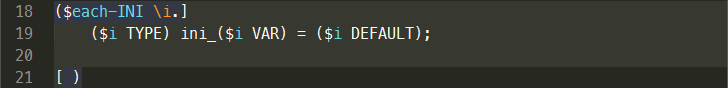

## Table of Contents

<!-- MarkdownTOC autolink="true" bracket="round" depth=0 style="unordered" autoanchor="false" -->

- [Standard Library \(stdlib.yu\)](#standard-library-stdlibyu)
	- [dict](#dict)
	- [if, unless](#if-unless)
	- [unfold](#unfold)
	- [do](#do)
	- [foo](#foo)
	- [define](#define)
	- [def](#def)
	- [undef](#undef)
	- [def-if](#def-if)
	- [skip-if, skip-if-not](#skip-if-skip-if-not)
	- [BIN, BB](#bin-bb)
	- [def-fn-argv](#def-fn-argv)
	- [INT_MAX, INT_MIN](#int_max-int_min)
- [Coroutines in C \(corolib.yu\)](#coroutines-in-c-corolibyu)
- [Coroutines in Python \(coroutine-py.yu\)](#coroutines-in-python-coroutine-pyyu)
- [Header Files Helper \(h.yu\)](#header-files-helper-hyu)

<!-- /MarkdownTOC -->

## Standard Library ([stdlib.yu](./stdlib.yu))

```
($import stdlib)
```

#### dict

```cpp
($dict NAME
	(` col_1_name   col_2_name     col_N_name  )
	(`
	(  col_1_val_1  col_2_val_1    col_N_val_1 )
	(  col_1_val_2  col_2_val_2    col_N_val_2 )

	(  col_1_val_M  col_2_val_M    col_N_val_M )
	)
)
```

This macro allows to define a series of lists that make it easy to generate
repeating code structures by a dictionary.

For example:


The foregoing application of `dict` macro corresponds to:

```cpp
($set each-INI (  0                        1     2                         3       ))
($set TYPE     (  QDate                    int   QString                   double  ))
($set VAR      (  date                     step  greeting                  Pi      ))
($set DEFAULT  (  (`QDate::currentDate())  0     "Hello! Improving Pi..."  0.0     ))
```

The application of `each-INI` spawns cycle from 0 to 3.



This snippet generates the following code:

```cpp
QDate ini_date = QDate::currentDate();
int ini_step = 0;
QString ini_greeting = "Hello! Improving Pi...";
double ini_Pi = 0.0;
```

#### if, unless

Another way to write a conditional expression.

```cpp
($if ($eq 4 ($add 2 2)) [ALL RIGHT] [SMOKE DETECTED])

ALL RIGHT
```

```cpp
($unless ($eq 4 ($add 2 2)) "It's impossible!" "OK")

"OK"
```

#### unfold

This macro allows to unfold a sequence of specified number of elements (the first argument).
If the number of arguments is greater than two, the second argument is the first element
of the sequence, and so on. The last argument is a lambda function with the sequence number
as a parameter, to calculate missing members of the sequence.

```cpp
($unfold 7 A B C \n.($add n 1))

ABC4567
```

#### do

The macro places an argument into the single-pass `do-while` statement. It's usually used
together with `define` macro.

```cpp
($do ]
	foo(); bar();
[ )

do {
	foo(); bar();
} while ( 0 )
```

#### foo

It does the same thing as `do` macro but using Statements in Expressions GNU Extension `({ })`.

#### define

Define C macro `($define signature body)`.

```cpp
($define,,CLEAR_VAR( var, mask ),,($do ]
	var &= ~( mask );
[ ))

#define CLEAR_VAR( var, mask ) do { \
	var &= ~( mask ); \
} while ( 0 )
```

#### def

```cpp
($def NAME)
```

Define empty C macro `NAME` and bind the same *yupp* atom with `1`.

```cpp
($def LINK_MODULE)

#define LINK_MODULE
```

#### undef

```cpp
($undef NAME)
```

Undefine C macro `NAME` and bind the same *yupp* atom with `0`.

```cpp
($undef LINK_MODULE)

#undef  LINK_MODULE
```

#### def-if

```cpp
(def-if COND NAME)
```

Define empty C macro `NAME` and bind the same *yupp* atom with `1` only if `COND` is true.

```cpp
($def-if LINK_MODULE LINK_MODULE_TEST)
```

#### skip-if, skip-if-not

```cpp
(skip-if COND)
```

Skip the rest of the current module depending on `COND`.

#### BIN, BB

Binary representation of the number.

```cpp
($hex ($BIN,,11001010110010100000))

0xcaca0

($hex ($BB,,10110011,,10110010,,10110001,,10110000))

0xb3b2b1b0L
```

#### def-fn-argv

Wrapper for variadic functions.

```cpp
($def-fn-argv int sumi ]
	int result = 0;
	($ &arg-begin)
	while ( ($ &arg-count)-- ) result += ($ &arg-value &type);
	($ &arg-end)
	return ( result );
[ )

int sumi( int argcnt, ... )
{
	int result = 0;
	va_list argptr;
	va_start( argptr, argcnt );
	while ( argcnt-- ) result += va_arg( argptr, int );
	va_end( argptr );
	return ( result );
}
```

#### INT_MAX, INT_MIN

Minimal and maximal values of `int32_t`.


## Coroutines in C ([corolib.yu](./corolib.yu))

Coroutine mechanics, implemented using the C language extensions "Labels as Values",
"Statements and Declarations in Expressions" (only in [coroutine.h](./coroutine.h))
and "Locally Declared Labels" (only in [coroutine.h](./coroutine.h)).

`($set corolib-use-c-macro 0)` to generate a direct C source code for coroutines,<br>
`($set corolib-use-c-macro 1)` to generate a source code based on macro definitions from [coroutine.h](./coroutine.h).

Based on Simon Tatham ["Coroutines in C"](http://www.chiark.greenend.org.uk/~sgtatham/coroutines.html).

```cpp
($import corolib)

($coro-context A);
($coro-context B);

($coro-define A ]
	for ( ; ; ) {
		/* ... */
		($coro-yield);
	}
[ )

($coro-define B ]
	for ( ; ; ) {
		/* ... */
		($coro-wait cond);
	}
[ \enter ]
	($coro-local) int b;
[ )

int main( void )
{
	for ( ; ; ) {
		($coro-call A);
		($coro-call B);
	}
	return 0;
}
```

See also - [ulam.yu-c](../eg/ulam.yu-c)


## Coroutines in Python ([coroutine-py.yu](./coroutine-py.yu))

Coroutine mechanics, implemented using generators.

```cpp
($import coroutine-py)

def ($coro A):
    while True:
        # ...
        ($coro-yield)

def ($coro B):
    while True:
        # ...
        ($coro-wait cond)

if __name__ == '__main__':
    ($coro-init A)
    ($coro-init B)

    while True:
        ($coro-call A)
        ($coro-call B)

    ($coro-uninit A)
    ($coro-uninit B)
```

See also - [coro.yu-py](../eg/coro.yu-py)


## Header Files Helper ([h.yu](./h.yu))

For example, `module.yu-h`:

```cpp
($import h)
($h-begin-named)

($extern-init,,unsigned int foo[ 4 ],,{ 0, 1, 2, 3 })
($extern) int bar;
($extern-c) void fn( char *a );

($inline) int max( int a, b ) { return (( a > b ) ? a : b ); }

($extern-c-begin)
int fn2( void );
($extern-c-end)

($h-end)
```

will be translated into `module.h`:

```cpp
#ifndef MODULE_H
#define MODULE_H

#ifdef  MODULE_IMPLEMENT
#define MODULE_EXT
#define MODULE_EXT_INIT( dec, init ) \
	dec = init
#define MODULE_EXT_C
#define MODULE_EXT_C_INIT( dec, init ) \
	dec = init
#define MODULE_INL
#else
#define MODULE_EXT extern
#define MODULE_EXT_INIT( dec, init ) \
	extern dec
#ifdef __cplusplus
#define MODULE_C "C"
#else
#define MODULE_C
#endif
#define MODULE_EXT_C extern MODULE_C
#define MODULE_EXT_C_INIT( dec, init ) \
	extern MODULE_C dec
#if __GNUC__ && !__GNUC_STDC_INLINE__
#define MODULE_INL extern inline
#else
#define MODULE_INL inline
#endif
#endif

#ifndef COMMA
#define COMMA   ,
#endif

MODULE_EXT_INIT( unsigned int foo[ 4 ], { 0 COMMA  1 COMMA  2 COMMA  3 } );
MODULE_EXT int bar;
MODULE_EXT_C void fn( char *a );

MODULE_INL int max( int a, b ) { return (( a > b ) ? a : b ); }

#ifdef __cplusplus
extern "C" {
#endif

int fn2( void );

#ifdef __cplusplus
}
#endif

#undef MODULE_EXT
#undef MODULE_EXT_INIT
#undef MODULE_EXT_C
#undef MODULE_EXT_C_INIT
#undef MODULE_INL
#undef MODULE_C
#endif
```

And `module.yu-c`:

```cpp
($import h)
($implement-named)

void fn( char *a )
{
}

int fn2( void )
{
	return ( -1 );
}
```

will spawn `module.c`:

```cpp
#define MODULE_IMPLEMENT

void fn( char *a )
{
}

int fn2( void )
{
	return ( -1 );
}
```
