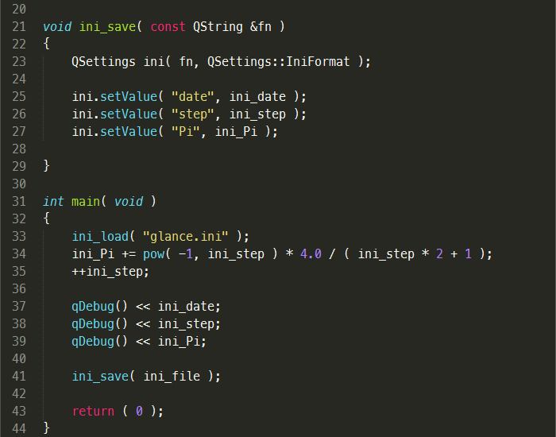

#### Sublime Text 2

This folder contains "navigational" plug-in and configuration files for Sublime Text 2 editor, just copy 
all into your Sublime Text folder. If new theme is not applied, please remove the cache of old theme 
`Data/Packages/Color Scheme - Default/Monokai.tmTheme.cache`.

