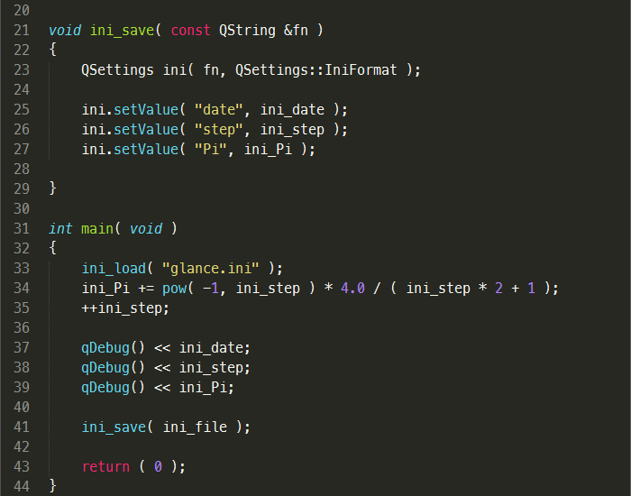

## **yupp** and Sublime Text

This folder contains a navigational plugin and configuration files for Sublime
Text. The plugin can switch between generated text and its origin. Its bundled
Python code and Python syntax definitions have been updated for Python 3.

The integration is not published as a Sublime package and is not otherwise
productized or supported by the Python wheel. To try it, copy the contents into
the corresponding Sublime Text data directory.

If the new theme is not applied, please remove the cache with the old theme 
`Data/Packages/Color Scheme - Default/Monokai.tmTheme.cache`.

